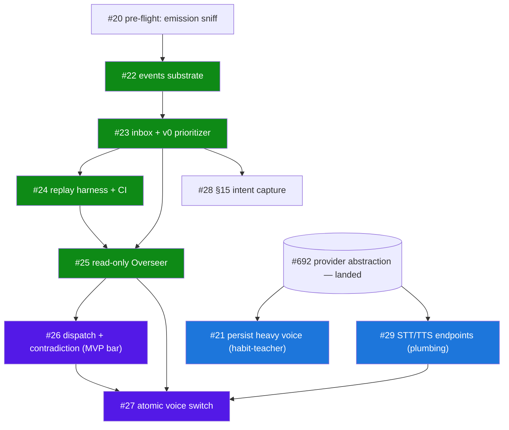
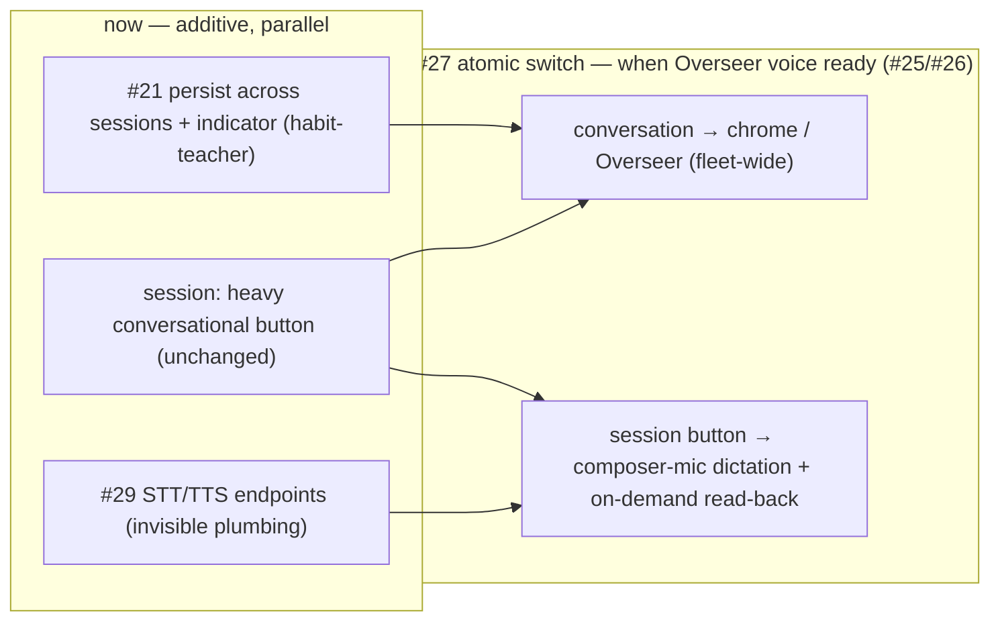
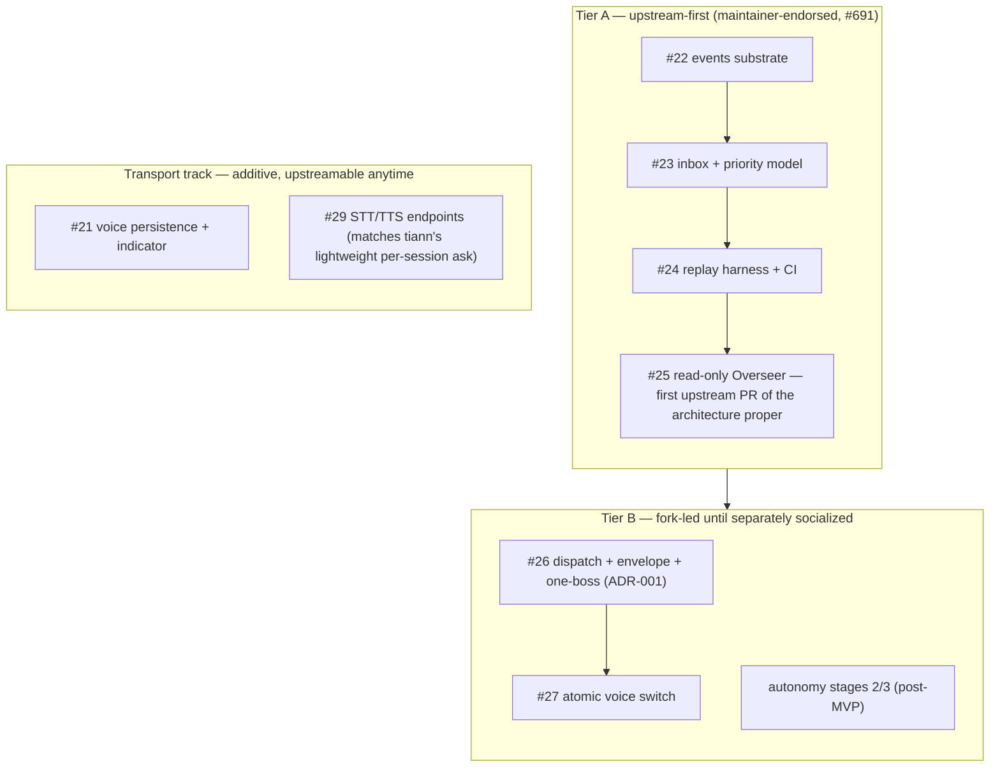
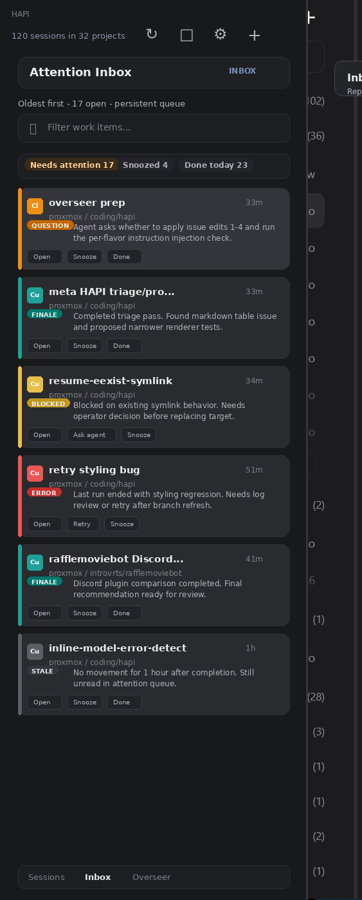
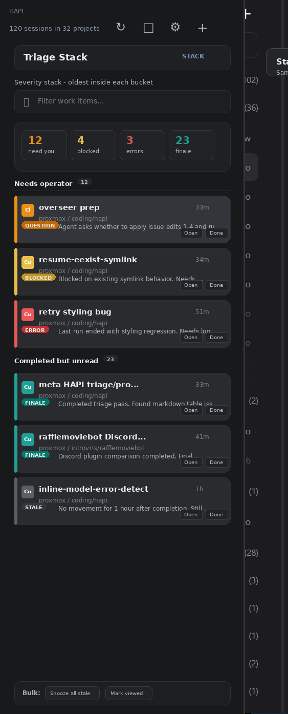

# Overseer — rollout shape and diagrams

> **Status:** fork-private rollout companion to the Rev 4 Overseer architecture docs. Captures the *delivery sequencing and upstream strategy* that evolved after the architecture was frozen — specifically the maintainer endorsement in `tiann/hapi` discussion #691 (2026-06-04) and the voice-layer reshaping decisions of 2026-06-05.
> **Date:** 2026-06-05
> **Scope:** the issue dependency graph (#19–#29), the voice-layer reshaping sequence, and the two-tier upstream rollout. Architecture substance is unchanged; this doc owns *order and strategy*, not design.
> **Leak discipline:** fork-private. Lives in `docs/plans/`, which never enters an upstream PR diff (leak scanner enforced). The two-tier rollout and issue-numbered DAGs below are fork-only. The sanitized architecture *shapes* (role/tier model, one-boss sequence, event→inbox promotion) may accompany an upstream design note in the maintainer's vocabulary; the strategy diagrams here may not.

> Companion docs (frozen Rev 4 architecture set — do not modify without lifting the freeze):
> - `2026-06-03-overseer-framing.md`, `2026-06-03-overseer-contracts.md`, `2026-06-03-overseer-prioritization.md`, `2026-06-03-overseer-build-sequence.md`
> - `docs/adr/0001-worker-facing-attribution-one-boss.md`

---

## Where this came from

The Rev 4 architecture set was sequenced defensively, before any maintainer signal. On 2026-06-04 the upstream maintainer (tiann) responded in discussion #691 and **endorsed the control-plane direction**: per-session voice should stay lightweight (STT to compose, TTS to read summaries), and "the more interesting direction is the control-plane layer above sessions: permission requests, blocked sessions, completions, and other attention events routed through one voice interface" — "matches HAPI's architecture better," with the landed provider abstraction (#692) named as "the right foundation."

That endorsement materially lowers the permanent-fork risk and lets the *substrate + read-only surface* travel upstream-first. The dispatch/one-boss/autonomy layer remains fork-led until separately socialized. This doc records the resulting delivery shape.

---

## 1. Build-sequence / issue dependency graph (#19–#29)

The trackable issue tree. Green = Tier-A (upstream-first, maintainer-endorsed). Purple = Tier-B (fork-led until socialized). Blue = parallel transport track (depends only on the landed provider abstraction, not the Overseer substrate).



Notes:

- **#20 → #22**: the emission-contract sniff calibrates how much the events substrate must lean on hub-observed synthesis vs. prompted emission. Kill-criterion: <~40% prompted compliance ⇒ rethink the primitive.
- **#21 is intentionally parallel** to the substrate — voice persistence is transport work that doesn't wait on events.
- **MVP acceptance bar is met when #26 lands.** #27 is post-MVP.
- **#28 (§15 intent capture)** absorbs the per-session scratchlist (#11) at fleet level *after* its v1 ships — not a supersede.

---

## 2. Voice-layer reshaping (now → atomic switch → after)

The settled answer to "voice belongs at the Overseer tier, not the worker tier." Everything additive happens now; the single destructive change (removing the per-session conversational button) fires only at the switch, when the Overseer has a conversational home — so there is never a conversation-less gap and never an interim "two ways to talk in a session."



Why this shape:

- The **heavy per-session conversational voice is kept** until the switch because it is the best available demonstration of "you can hold a conversation while doing other work" — the core habit the Overseer depends on. Ripping it out early would delete the teacher and leave the daily driver conversation-less.
- The persistence work in #21 is **not throwaway**: `voiceFocus: { kind: 'session' | 'overseer' | 'fleet' }` makes the switch a re-target (`session → overseer`), not a rewrite.
- **Provider capability is verified (2026-06-04)**: ElevenLabs (Scribe STT + TTS), Gemini (Cloud STT/Chirp + Gemini-TTS), Qwen/DashScope (Paraformer/Qwen3-ASR + CosyVoice) all expose standalone STT and TTS decoupled from their realtime layer. Endpoint *shapes* differ (e.g. Gemini STT = audio → `generateContent`), so #29 needs a per-backend capability shim. The "provider lacks a standalone endpoint" risk is theoretical for the current set.
- **Dictation never auto-sends.** A per-session message is an instruction a worker acts on; STT errors on code/jargon are high, so transcription fills the composer for review and the operator presses send (the ChatGPT dictate pattern).

### Why cross-session *conversation* is justified here (and absurd in a chat app)

A chat app has no "talk to all your threads at once" because threads are independent **topics** with no shared state — "conversations you must complete" is meaningless. HAPI work sessions are **things you must do**, each with a completion state, all serving one objective; "what needs me next?" is a real question across them. The aggregation target isn't the conversations — it's the **attention queue over work states** (the inbox). That is exactly what a chief-of-staff conversation arbitrates, which is why conversation belongs at the fleet/Overseer tier while the session keeps only speech transport.

---

## 3. Two-tier upstream rollout

What travels upstream first, what stays fork-led, and what is additive transport that can go upstream anytime.



Rationale:

- **Tier A** is precisely what tiann described — "attention events routed through one voice interface." #25 (read-only Overseer) is the natural first upstream PR of the architecture proper; #22/#23/#24 are pitched as its prerequisites.
- **Transport track** delivers the lightweight per-session voice the maintainer explicitly wants, with no dependency on the Overseer substrate.
- **Tier B** is the genuinely novel commitment the maintainer has not weighed in on — the Overseer dispatching back into worker sessions, operator-attribution-hiding (one-boss), and autonomy. Keep it fork-led; do not fold it into a Tier-A pitch.
- **Vocabulary**: upstream-facing artifacts lead with the maintainer's terms — "control-plane attention layer," "attention-event routing," "one voice interface" — and cite #691. Internal docs keep "Overseer."

---

## 4. Attention inbox — the v1 wedge (mocks + decisions)

The attention inbox is the **first concrete surface** of the Overseer: a persistent per-session attention queue that captures agent terminal states as operator work items. It is **deliberately dumb** — its job is not to be smart, it is to be the *instrumented training ground* whose operator-action data later teaches the cross-session salience model. Strategic framing (adopt verbatim for the upstream pitch):

> A persistent per-session attention queue that captures agent terminal states and operator-required follow-up, forming the event substrate for the future Overseer. It captures per-session terminal states as persistent operator work items, records operator responses as preference signals, and creates the event stream from which cross-session salience and attention-marketplace behaviour can later be learned.

> Mock images are embedded below (`assets/overseer-attention-inbox-mock.png`, `assets/overseer-triage-stack-mock.png`); the faithful text reproductions beneath them are the durable, implementer-facing record.

### View A — Attention Inbox (v1 default render)

Persistent queue, default-sorted by **coarse category rank, then oldest-first within each tier** (so a fresh `QUESTION`/permission sits above an old `FINALE`, but within a tier the oldest is forced up — email discipline preserved). One item per session terminal state. The mock's "Oldest first" subtitle reflects the pure-age variant; v1 ships rank-then-age.



```
HAPI   120 sessions in 32 projects                 [↻] [■] [⚙] [+]
┌──────────────────────────────────────────────────────────────┐
│ Attention Inbox                                         INBOX  │
│ ( Needs attention 17 | Snoozed 4 | Done today 23 )             │
├──────────────────────────────────────────────────────────────┤
│ ▎Cl  overseer prep   QUESTION  Agent asks whether to apply     │
│      issue edits 1-4.        [Open] [Snooze] [Done]            │
│ ▎Cu  meta HAPI triage  FINALE         [Open] [Snooze] [Done]   │
│ ▎Cu  resume-eexist-symlink  BLOCKED   [Open] [Ask agent] [Snooze]│
│ ▎Cu  retry styling bug  ERROR         [Open] [Retry] [Snooze]  │
│   … rafflemoviebot (FINALE 41m) · inline-model (STALE 1h)      │
├──────────────────────────────────────────────────────────────┤
│ Sessions | [Inbox] | Overseer                                  │
└──────────────────────────────────────────────────────────────┘
```

### View B — Triage Stack (later, power-user toggle)

Same items, grouped into severity buckets (the coarse rank), oldest inside each bucket. Useful once the queue gets noisy; **not** the v1 default.



```
┌──────────────────────────────────────────────────────────────┐
│ Triage Stack                                            STACK  │
│  [12 need you]  [4 blocked]  [3 errors]  [23 finale]           │
├── Needs operator (12) ─────────────────────────────────────────┤
│ ▎Cl overseer prep QUESTION · ▎Cu resume BLOCKED · ▎Cu retry ERROR│
├── Completed but unread (23) ───────────────────────────────────┤
│ ▎Cu meta triage FINALE · rafflemoviebot FINALE · inline STALE  │
│ Bulk: [Snooze all stale]  [Mark viewed]                        │
└────────────────────────────────────────────────────────────────┘
```

**One inbox, two views** — not two products. View A (flat, rank-then-age) is the v1 default; View B (severity stack) is a later grouping toggle over the same items. Bottom nav (`Sessions / Inbox / Overseer`) is the settled IA: Inbox = read-only attention surface; Overseer = where you later converse about it.

### Confirmed v1 decisions (operator, 2026-06-05 / 06-18)

1. **Deliberately dumb, but coarse-ranked.** Default ordering = coarse category rank (`permission > blocked > error/needs-decision > completion`), **oldest-first within each tier** (email discipline). A **fixed, hand-set rank — NOT learned salience**. Renderable flat (rank-then-age) or as severity buckets. Keeps faith with the #691 "priority model first" commitment; only *learned* salience is deferred.
2. **Strictly per-session.** One attention item per session terminal state. **No** cross-session dedupe / merge / root-cause in v1 — deferred to the Overseer (#25).
3. **Operator actions logged as training labels from day one**, even though nothing consumes them yet — the dataset *is* the point. Operator-facing object name: **"Attention Item"** (schema = `inbox_items`, contracts §3).
4. **Artifact-centric card titles where available** — prefer an `artifact_ref` (PR/issue/branch) as the title over the session name, falling back to the session name. Depends on workers emitting artifact handles (#22; reliability measured in #20).

### Operator actions are labels (the training signal)

| Action | Learned meaning |
|---|---|
| Open | deserved inspection |
| Reply (→ navigates to the session chat) | required intervention |
| Done | valid but finished |
| Snooze | matters, but not now |
| Dismiss | was noise |
| Delete | should not have been surfaced |
| Route | belonged elsewhere |
| Retry | operational, not cognitive |

`Reply`/`Ask agent`/`Retry`/`Route` are **dispatch** → Tier-B (#26); they must be **absent/disabled in the v1 read-only pane**. v1 ships `Open` / `Snooze` / `Done` / `Dismiss` + bulk only.

### Failure mode — "do not become email"

Guardrails: strong stale expiry, severity-label discipline, a clear `FYI` vs `you-must-decide` split (FYI ⇒ captured-only, never queued), bulk handling, and "why am I seeing this?" answerability (provenance, §11).

## 5. Return-from-away briefing ("brief me" / fleet "standup") — #51

When the operator starts work (or returns after being away), they want something resembling a scrum standup — but the *ceremony* is meatspace baggage and the *schedule* is irrelevant to a fleet.

- **Drop the schedule.** Scheduled standups exist so humans can converge; an agent fleet needs no convergence. Trigger = **operator-initiated ("brief me") + attention-gap (return-from-away)**, never clock-driven.
- **Keep the function, drop the roll-call.** Map the three scrum questions to the fleet: *what changed since last* (deltas) · *what's blocking* (top of inbox) · *what's the plan* (recommended focus). Deliver it **synthesized** ("3 finished, 2 routine, 1 needs you because it changes PR scope"), never a per-agent enumeration.
- **Near-term primitive (trackable now):** a per-operator **`last_seen_at` / attention watermark** + a **since-last-seen delta query** over events/inbox (#22/#23). A second consumer falls out for free: *"what did you handle while I was away?"*
- **Briefing interaction is gated on a nascent Overseer (#25)** — the synthesis needs the Overseer entity; not buildable on the dumb substrate alone.
- **Relationship to "what's next?":** same data, different intent. *"What's next?"* = pull-one (Brazil bang-bang); *"Brief me"* = orient-all-with-deltas. Keep both. It is the §9 `digest` *content* minus the schedule, and the fleet-level analog of HAPI's per-session "Greet me / Brief me" split.

Tracked in #51.

## 6. Execution plan — ordered build sequence to "the Overseer"

The ordered work an agent (or agents) execute. Waves respect dependencies; **within a wave, items can run in parallel agents.** Critical path = substrate→overseer→dispatch spine; transport and UI tracks run alongside. Tier-A = upstream-first; Tier-B = fork-led.

### Critical path (sequential — each wave gates the next)

| Wave | Issue | Delivers | Gated by | Tier |
|---|---|---|---|---|
| 0 | **#20** pre-flight emission sniff | emission compliance + delivery-channel (inline vs AGENTS.md) → recalibrates #22 | — | A |
| 1 | **#22** events + per-turn-summary emission | `events` + `event_links` + FTS5; summary-carrier emission + hub-observed fallback | #20 | A |
| 2 | **#23** inbox + dumb v1 ordering + action logging | `inbox_items`; per-session promotion; coarse-rank/oldest-within; action logging | #22 | A |
| 3 | **#24** replay harness + CI gate | golden scenarios + one-boss invariant stub + CI gate | #23 | A |
| 4 | **#25** read-only Overseer wired to voice | Overseer entity + read-only tools + voice route + `convo_turn` | #23, #24 | A |
| 5 | **#26** dispatch + contradiction (**MVP BAR**) | dispatch envelope + confirm UX + one-boss activates + contradiction | #25 | B |
| 6 | **#27** chrome voice switch (post-MVP) | conversation → chrome; per-session → dictate + read-back (atomic) | #26, #25, #29 | B |

**MVP acceptance bar is met when Wave 5 (#26) lands.**

### Parallel tracks

- **Transport (anytime; depends only on landed #692):** **#21** voice persistence (habit-teacher); **#29** standalone STT+TTS endpoints. Both must finish before Wave 6's switch.
- **UI (depends on #23):** the first-class **attention-inbox pane** (desktop+mobile) — separate agent; ships read-only (Open/Snooze/Done), dispatch actions deferred to #26.
- **Riders:** **#51** watermark lands with #22/#23 (briefing rides #25); **#28** intent capture rides #23 + #25.

### Fan-out guidance

- Critical path is one agent handing to the next (#20→#22→#23→#24→#25→#26→#27).
- From Wave 1 on, fan out a transport agent (#21/#29) and the UI-pane agent (after #23) in parallel.
- Fold #51/#28 into the relevant substrate/voice wave or run as small follow-on agents.

## 7. Emission contract — `AGENT_NOTIFY_SUMMARY` is the substrate (Phase 1 → Phase 2)

The emission contract is **not** a new `HAPI_EVENTS` sentinel format. The operator already runs a canonical per-turn outcome contract at the top of the AGENTS stack (home-level `AGENTS.md`), wired to voice / tmux marquee / push via `~/coding/agent-notify` (`ACTUALSPEC.md` rev 16) and already parsed by `extractNotifySummary` (driver `shared/src/messages.ts`) — whose own comment anticipates *"the meta-event bus when Phase 2 lands."* **The Overseer events table IS that Phase 2.** Making the emission contract "first-class" = lifting it from an operator-stack instruction into HAPI-native infrastructure.

### The contract (canonical)

Last line of every agent response:

```
AGENT_NOTIFY_SUMMARY {"version":1,"agent":"..","project":"..","status":"done|blocked|needs_review|needs_decision|failed|stalled","action":"<concrete next user action>","summary":"<1-line triage>"}
```

Falls back to transcript / semantic summarization when missing (= the hub-observed fallback). Already works reliably for **Cursor** (reads home `AGENTS.md` natively).

### Field mapping → Overseer

| `AGENT_NOTIFY_SUMMARY` | Overseer | v1 inbox badge |
|---|---|---|
| `status` enum | `event_type` / category | done→FINALE · needs_decision→QUESTION · blocked→BLOCKED · failed→ERROR · stalled→STALE · needs_review→review |
| `action` | `suggested_action` / "what you do next" | actionable line on the card |
| `summary` | event summary | card body |
| `agent` / `project` | source attribution | flavor chip + project |
| `version` | `schema_version` | — |
| missing → transcript fallback | hub-observed fallback | — |

The **`status` enum is the v1 inbox taxonomy** — operator-proven, supersedes the ad-hoc QUESTION/BLOCKED/ERROR/FINALE/STALE labels (those were aliases for these). It also converges with the "Attention Item" shape sketched in `docs/chad-operator-overseer-chat.md`.

### v1 `attention_candidate` derivation (no new agent fields)

- `needs_decision` / `blocked` / `failed` / `needs_review` / `stalled` → `attention_candidate = 1`
- `done` → candidate **iff** `action` is non-empty (review/deploy/follow-up), else captured-only

### What this changes

- **§1 (contracts):** emission wire format = `AGENT_NOTIFY_SUMMARY` (last-line JSON), **not** `HAPI_EVENTS` sentinels. Extend `NotifySummary` later with attention fields (`severity`, `artifact_refs`, `operator_action_required`, `risk_detected`); v1 derives them from `status` + `action`.
- **#22 recast:** "**HAPI-native-ize `AGENT_NOTIFY_SUMMARY` → events table**" — HAPI injects the contract for non-Cursor flavors (inline message prefix, per #20); parse via `extractNotifySummary`; route `status → event_type` + derived `attention_candidate`. Emission + parse + reliability already exist, so #22 **shrinks** and the foundation emission-reliability risk is **largely retired**.
- **#20 reinterpretation:** the "`AGENT_NOTIFY_SUMMARY` collision" was the signal to **standardize on it**, not strip it. Cursor's low sniff score (36%) was a **sandbox artifact** — the sniff tested the new `HAPI_EVENTS` format without home `AGENTS.md`; the real contract works best for Cursor. Surviving finding: **non-Cursor flavors (Claude/Codex) need HAPI to inject the contract** (inline prefix), and the hub can't attach `appendSystemPrompt` per-turn over REST yet.

### References

- The contract: home-level `AGENTS.md` (operator stack).
- Reliability spec: `~/coding/agent-notify/ACTUALSPEC.md` (rev 16 — contract-wins, JSONL catch-up, EUREKA verification).
- Parser: driver `shared/src/messages.ts` `extractNotifySummary` + `NotifySummary` type.
- Live event-stream consumer: `scripts/hapi-voice-subscriber.ts`.

## Architecture-shape diagrams (pending freeze lift)

These describe the system rather than the rollout and belong in the frozen Rev 4 docs, replacing existing ASCII art. They are upstream-safe (sanitized). Not embedded here to avoid duplicating canon; to be added to the architecture docs once the freeze is lifted:

- Role/tier model (Operator ↔ Overseer ↔ Workers ↔ event stream) — `flowchart` → framing doc
- Three-layer event → inbox promotion — `flowchart` → contracts doc
- Prioritization loop — cyclic `flowchart` → prioritization doc
- One-boss dispatch boundary (envelope never reaches the worker) — `sequenceDiagram` → ADR-001 / §13
- Edict/action lifecycle, inbox status transitions, worker state model — `stateDiagram-v2` → contracts §4 / §3 / §2
- Data model (events / event_links / inbox_items / dispatch_envelope / intent_items) — `erDiagram` → contracts doc
