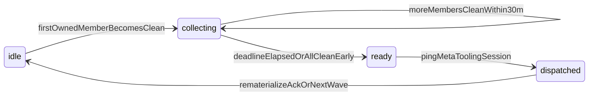

# Plan: Wave-clear unlock + three daily Meta pings

> **Status:** implemented 2026-07-29  
> **Date:** 2026-07-29  
> **Gate choice:** **A** — owned sessions only (layer gone + worktree gone). Orphans are anomalies and never block.  
> **Rebuild contention:** unlock defers when `hapi-driver-status --quiet` returns 75 (manual mid-window rebuilds OK).

## Intent

Chips already refresh every 45m. Peers need more than one wake-up per day. When a merge wave’s **owned** cleanups are done, the system should **collect** “need soup rebuild” signals for ~30 minutes, then **unlock** the Meta tooling bot to rematerialize once - Overseer-shaped, inbox as the bus.

Orphans (merged PR, no HAPI session) are **anomalies**, not a gate. They never block wave-clear; Meta only surfaces them as a warning. (Religious peer-session process: every real PR has an owner.)

## Authority correction

Meta daily CLI still does **not** run `hapi-driver-rebuild` itself (keeps the classifier small and fail-closed). The **Meta tooling HAPI session** (and any agent following soup rules) **may** rematerialize without waiting for operator approval - same as current lifecycle. This work only **schedules and unlocks** that bot with a clear brief.

## Schedules (Europe/London wall clock)

| Unit | Cadence | Behavior |
|------|---------|----------|
| `hapi-meta-daily-refresh.timer` | every 45m 24/7 | classify + chip cache + `--emit-events`; **`--no-ping`** |
| `hapi-meta-daily.timer` | **hourly :00 Europe/London** | full Meta **with pings** (BST summer / GMT winter; host may stay UTC) |

Replace `scripts/tooling/systemd/hapi-meta-daily.timer` with three `OnCalendar=` lines; drop long `RandomizedDelaySec` (optional short 2–3m max). Reinstall via `install-hapi-meta-daily-timer.sh`. Document in `docs/operator/AGENTS.md`.

## Wave membership and clear gate (A)

On each Meta run, build the **active merge wave**:

- Recently merged PRs Meta already tracks (existing “merged last 7d” + sessions with chip `status=merged`)
- **Only members with an owning HAPI session** (chip / `PR_SESSIONS`)
- Orphans: list under `Q_ORPHAN` as anomaly; **exclude from wave-clear math**

A member is **clean** when all of:

1. No active `- branch:` in `~/.config/hapi/driver-manifest.yaml` attributable to that PR/session (DROPPED comments OK)
2. No matching worktree under `~/coding/hapi/worktrees/` for that peer’s known paths (from session metadata / prior state), **or** peer left an explicit cleanup-ack marker Meta already understands (prefer mechanical checks; ack text is optional sugar)

Pure helpers in `scripts/tooling/lib/pr-emoji-core.sh` (or sibling `lib/meta-wave.sh`) + unit tests:

- `pec_wave_member_clean(manifest_text, worktree_list, member) → 0/1`
- `pec_wave_clear(members[]) → clear|blocked` + reason list

## Inbox collect window (30m)

State in `${XDG_STATE_HOME}/hapi/meta-daily.json` (extend existing schema):

```json
"wave": {
  "id": "2026-07-29T15",
  "members": [{"pr": 896, "sid": "a48b8713…", "clean": true}],
  "collect_started_at": 1785000000000,
  "collect_deadline_at": 1785001800000,
  "status": "idle|collecting|ready|dispatched"
}
```

Flow:



1. When the first owned merged member flips **clean**, Meta emits an inbox-bound channel event (existing `--emit-events` / `POST /api/system-events` path) like `soup_rebuild_requested` / wave member ready, and starts **collect** (`collect_deadline_at = now + 30m`).
2. Further members cleaning during the window join the same `wave.id`.
3. When **all owned members are clean** **or** the 30m deadline elapses with **at least one** clean member and **zero** still-dirty owned members: set `status=ready`.
4. If deadline elapses while some owned members are still dirty: **do not** unlock; sticky-ping those peers on the next ping window; resume fuse when the last blocker clears.
5. On `ready` (**ping-enabled runs only**): ping Meta tooling session with WAVE CLEAR brief (wave id, PR list, rematerialize steps). Set `dispatched`.
6. Config: `HAPI_META_TOOLING_SESSION_ID` in `~/.hapi/meta-daily.env` (required for unlock ping; if unset, print READY in queue only - fail soft).

Quiet refresh (`--no-ping --emit-events`) may advance collect state and emit inbox events, but must **not** ping the Meta tooling session.

## What Meta CLI still never does

Does not itself invoke `hapi-driver-rebuild` / edit manifest / archive. Unlock narrative points at the Meta tooling bot.

## Docs / skills

- `docs/operator/AGENTS.md` — three ping times; wave-clear A; 30m collect; unlock ping; orphans = anomaly
- `docs/tooling/feature-work-lifecycle.md` § After upstream merge
- `docs/tooling/README.md` — timer table
- Optional note linking Overseer inbox prep session `baa3e4cf-1295-467f-b384-e8e346e07566`

## Tests

- Unit: wave member clean / clear / orphan excluded
- `hapi-meta-daily.test.sh`: collect start; no unlock while dirty owned remains; unlock when all clean; soft-fail without tooling session id; `--no-ping` does not ping tooling session

## Install

`sudo bash scripts/tooling/install-hapi-meta-daily-timer.sh` on oos after landing. Set `HAPI_META_TOOLING_SESSION_ID` in `~/.hapi/meta-daily.env`.

## Out of scope

- Full Overseer UX polish (coordinate with EX overseer prep session for inbox consumer)
- Auto-running rebuild from systemd / Meta CLI
- Treating orphans as wave members

## Implementation todos

1. Change `hapi-meta-daily.timer` to 07:30 / 15:00 / 20:00 Europe/London; update installer + AGENTS
2. Add pure wave-clear helpers + unit tests
3. Extend `meta-daily.json` wave collect/ready/dispatched + 30m fuse
4. Emit inbox events on quiet+ping runs; unlock ping Meta tooling only on ping runs
5. Docs, integration tests, reinstall timers, document env var
