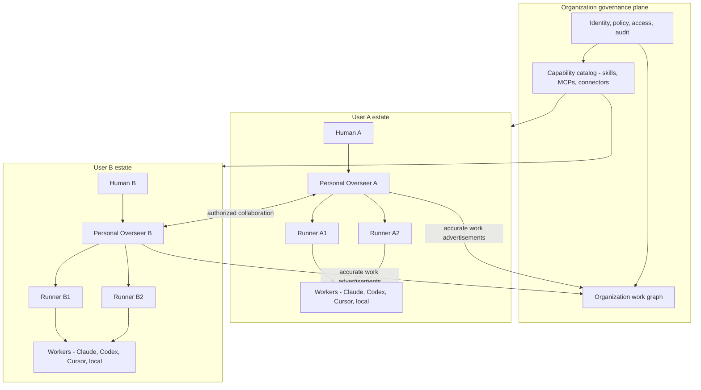
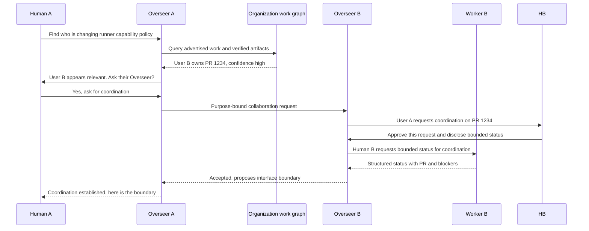

# What I think is happening to agent ecosystems, and what it could mean for HAPI

> **Status:** strategic thesis / manifesto, not an implementation plan
> **Date:** 2026-07-30
> **Scope:** HAPI's possible evolution from local-first remote control into a multi-agent, multi-runner, eventually multi-user operating fabric
> **Audience:** HAPI maintainers, fork operators, Overseer peers, and anyone deciding which future HAPI should build toward
> **Epistemic rule:** facts, bets, and aspirations are separated deliberately. A bet is not made true by writing it in bold.

---

## Thesis

**HAPI can become the local-first, vendor-neutral operating fabric for software-engineering work performed by humans and agents: a system in which each person has a coherent estate across every machine and coding agent they use; capabilities such as skills and MCPs are governed once and materialized wherever needed; a personal Overseer arbitrates attention across the person's worker fleet; and, when explicitly authorized, Overseers communicate with other Overseers through an accurate, auditable work graph so teams can collaborate without collapsing into any one vendor's ecosystem.**

In shorter form:

> **Vendors are building vertically integrated agent empires. HAPI's opportunity is to be the horizontal fabric across them.**

That is larger than HAPI's current stated purpose. It should not erase that purpose. The credible path begins with the thing HAPI already does unusually well:

> **Your agents keep working on your machines while you stop being chained to the desk.**

The future thesis is an extension of that promise:

> **Your work should remain coherent when the agent, model, machine, device, or eventually human collaborator changes.**

---

## 1. What HAPI says it is today

The public site is admirably direct. [hapi.run](https://hapi.run/) sells:

- "Vibe Coding Anytime, Anywhere"
- start on desktop, continue from phone, switch back at any time
- local sessions with the phone as a window
- remote approvals, terminal access, notifications, session persistence, and multi-agent support
- freedom from watching progress bars

The repository README adds two strategically important commitments:

- **Native first:** HAPI wraps official agents instead of replacing them.
- **Your AI, your choice:** Claude Code, Codex, Cursor Agent, Grok Build, OpenCode, and others share one workflow.

The public [Why HAPI?](https://hapi.run/docs/guide/why-hapi) page is even more constraining:

- each user runs their own hub
- data remains on the user's machine
- SQLite and a single binary replace a multi-service cloud stack
- HAPI is explicitly contrasted with Happy's centralized, multi-user architecture
- the target user is a self-hoster who values data sovereignty

The public [How it works](https://hapi.run/docs/guide/how-it-works) page calls seamless local-to-remote handoff HAPI's defining feature. It describes a hub coordinating CLI sessions, runners, web clients, permissions, messages, and remote spawning.

So the current product is not confused. It is:

> **A single-user, local-first, self-hosted remote control plane for native coding agents.**

That remains a good product. The thesis in this document asks whether the same architecture contains the seed of something more consequential.

### A useful correction to the public language

"All AI processing happens locally" is too broad if the wrapped agent calls a cloud model API. What is reliably local is the **execution environment, workspace, session process, and HAPI data plane**. Model inference may be local or remote. That distinction becomes strategically valuable as local models improve.

---

## 2. What appears to be happening in the wider landscape

### 2.1 Each major vendor is building a vertical "whole pie"

The pattern is visible across Anthropic, OpenAI, and Cursor:

1. Start with a strong model or coding interface.
2. Add an agent harness and persistent instructions.
3. Add skills, plugins, rules, hooks, and MCP/connectors.
4. Add cloud/background execution and parallel workers.
5. Add team sharing, centralized policy, identity, secrets, audit, and access controls.
6. Add orchestration, reusable agents, progress reporting, and management surfaces.

This is rational. The harness controls context, tools, permissions, telemetry, distribution, billing, and user lock-in. A vendor that owns the model but not the work loop leaves too much value on the table.

The vendors are not symmetrical:

- **Cursor** most clearly treats frontier models as selectable commodities inside a Cursor-owned harness, while also building its own Composer models.
- **Anthropic** is vertically integrating around Claude. It is opening protocols and extension formats, not treating rival foundation models as peers inside Claude Code.
- **OpenAI** exposes open clients, custom providers, and programmable orchestration, but its hosted stack strongly favors OpenAI models and captures value through model access, cloud execution, ChatGPT distribution, and governance.

The shared bet is vertical integration. "All vendors will commoditize foundation models" is not supported.

#### Anthropic

Anthropic already offers:

- organization-provisioned skills for Team and Enterprise users
- enterprise, personal, project, and plugin skill scopes
- centrally managed settings for Claude Code clients
- centrally governed MCP allowlists and fixed managed MCP sets
- organization connectors that can become available in Claude Code
- local Claude Code execution under organization policy

Sources:

- [Provision and manage skills for your organization](https://support.claude.com/en/articles/13119606-provision-and-manage-skills-for-your-organization)
- [Claude Code skills](https://code.claude.com/docs/en/skills)
- [Claude Code MCP](https://code.claude.com/docs/en/mcp)
- [Managed MCP configuration](https://code.claude.com/docs/en/managed-mcp)
- [Server-managed settings](https://code.claude.com/docs/en/server-managed-settings)

#### OpenAI / Codex

OpenAI describes asynchronous, parallel Codex work as a likely default form of software production. Its platform now includes:

- cloud Codex agents running tasks in parallel
- Codex CLI, desktop, IDE, and web surfaces
- skills as reusable workflows
- plugins as distribution for skills and connectors
- MCP configuration shared across local Codex clients on the same host
- enterprise-managed requirements for permissions, hooks, MCP allowlists, plugins, filesystems, networks, and approvals
- Agents SDK orchestration with manager agents, handoffs, guardrails, and traces

Sources:

- [Introducing Codex](https://openai.com/index/introducing-codex/)
- [Codex customization](https://developers.openai.com/codex/concepts/customization)
- [Build Codex skills](https://developers.openai.com/codex/skills)
- [Codex MCP](https://developers.openai.com/codex/mcp)
- [Codex managed configuration](https://developers.openai.com/codex/enterprise/managed-configuration)
- [Codex with the Agents SDK](https://developers.openai.com/codex/guides/agents-sdk)

#### Cursor

Cursor has moved beyond an editor:

- Cloud Agents run in isolated managed VMs and can execute many tasks in parallel.
- Agents can be started from mobile, web, desktop, Slack, GitHub, Bitbucket, Linear, or API.
- Teams can configure MCP servers, secrets, hooks, environments, and network access.
- Cloud Agent runs, conversations, changes, and artifacts can be shared with teammates.
- Team Rules are centrally distributed, may be enforced, and take precedence across repositories.
- Remote rules can be synchronized from GitHub.

Sources:

- [Cursor Cloud Agents](https://cursor.com/docs/cloud-agent)
- [Cursor Rules and Team Rules](https://cursor.com/docs/rules)

### 2.2 The strategic inference

The facts above do not prove that every vendor will ship a personal chief of staff and an organization-wide fleet manager. No vendor currently demonstrates a reliable autonomous software organization that resolves dependencies, ships, monitors production, and learns without substantial human management. The Death Star is under construction, not operational.

The inference is nevertheless strong:

- They already own worker identity, execution, capability distribution, permissions, and telemetry.
- They increasingly expose parallel asynchronous workers.
- Parallel workers create an attention-routing problem.
- A manager/assistant that summarizes, delegates, and escalates is the obvious next layer.
- A team-level manager that reads subordinate users' work graphs is a further extension of the same data.

If Anthropic ships an "Overseer," it will naturally understand Claude's workers best. If OpenAI ships one, it will naturally operate through Codex, ChatGPT, OpenAI plugins, and OpenAI policy. Cursor's equivalent will naturally privilege Cursor agents and Cursor Cloud.

This is not villainy. It is vertical integration.

### 2.3 Agents and models begin to blur into a commodity layer

Today Claude Code, Codex, and Cursor are not merely model selectors. Their harnesses differ materially:

- tool protocols
- context assembly
- permissions
- resumability
- cloud execution
- skills and plugin formats
- error recovery
- team policy
- UI and workflow integration

So "agent equals model" is not yet literally true.

But from the user's desired perspective, it increasingly should become true:

> Pick the worker best suited to the task, much as one picks a model, without emigrating to another operational country.

HAPI's native-first adapters already point in this direction. The user chooses a worker flavor, but sessions, files, terminal, approvals, notifications, machines, and mobile control remain recognizably HAPI.

That is the germ of agent commoditization: not making agents identical, but making their differences **selectable rather than sovereign**.

---

## 3. The local-model disruption

Local models do not need to beat every frontier model at every task to alter the platform economics.

They need to become:

- good enough for a large, identifiable class of work
- reliable under structured tool use
- cheap enough to run persistently
- private enough to unlock sensitive workloads
- fast enough to occupy real-time or high-volume roles

That is already plausible.

### Evidence available now

- OpenAI's Apache-licensed [`gpt-oss`](https://github.com/openai/gpt-oss) models explicitly target local and on-premises reasoning, tool use, structured output, browsing, and agentic operation. The 20B model targets consumer-class hardware; the 120B model targets a single 80GB-class accelerator.
- Mistral's original [Devstral](https://mistral.ai/news/devstral/) proved that a 24B model trained for an agent scaffold could run on a single RTX 4090 or 32GB Mac. That release is now deprecated and should be treated as historical evidence, not a current platform recommendation.
- Qwen's [Qwen3.6-27B](https://huggingface.co/Qwen/Qwen3.6-27B) explicitly targets agentic coding, repository reasoning, tool calling, and local deployment through standard inference engines.
- HAPI's own July 2026 evaluation identified local Qwen3-14B as a candidate for guarded, read-only Stage-0 Overseer dogfood on a 16GB GPU, and Qwen3.6-27B on a 5090-class machine as a possible quality path. The proposed guardrails have not yet proved their improvement. At 63% raw end-answer correctness, the tested 14B configuration is nowhere near a safe dispatch authority. See `docs/plans/2026-07-29-overseer-brain-llm-eval.md`.

Benchmarks should be treated carefully. SWE-bench scores depend heavily on scaffold, environment, test selection, and reporting discipline, and public solutions can contaminate training. Terminal-Bench found large gains from changing both model and scaffold; a model score is not a property of weights alone. The important strategic fact is not a particular percentage. It is that capable, tool-using, open-weight models now fit on hardware owned by individual developers and small teams.

### The counterintuitive implication

Better local models do not necessarily reduce HAPI's value. They may increase it.

If model intelligence becomes cheaper and more interchangeable, value migrates toward:

- the harness
- the execution environment
- persistent state
- capability distribution
- placement across hardware
- policy and credentials
- work graphs
- evaluation
- attention arbitration
- human trust

Those are control-plane problems.

Vendor ecosystems can subsidize their harnesses with model margins and cloud lock-in. HAPI can offer a different bargain:

> **Use frontier models where they earn their cost; use local models where privacy, latency, availability, or volume matter; preserve one operating experience across both.**

### A likely model hierarchy

Different roles may settle at different intelligence and latency points:

| Role | Likely model economics |
|------|------------------------|
| Difficult architecture / novel debugging | Frontier cloud model |
| Routine implementation / tests / migrations | Local or low-cost coding model |
| Fast triage / summarization / classification | Small local model |
| Personal Overseer, read-only | Fast local model with deterministic tools and guardrails |
| Overseer dispatch / high-impact policy | Stronger local model or frontier model, confirmation-gated |
| Background monitoring / event scoring | Deterministic code first; model only where semantics require it |

The future is probably not "local replaces cloud." It is **model routing by job, risk, privacy, latency, and cost**.

That strengthens the case for a vendor-neutral plane.

---

## 4. The fullest HAPI shape

The proposed destination has three orthogonal axes:

1. **Many workers and model backends:** Claude Code, Codex, Cursor, Pi backed by local Qwen, and future combinations.
2. **Many runners:** every machine in a user's estate, with different hardware, workspaces, credentials, and capabilities.
3. **Many users:** each with a personal estate and Overseer, joined by an organization governance and collaboration layer.

Vendor products invest heavily in all three axes, but their runner expansion is mainly into vendor-managed cloud execution and their worker expansion privileges their own ecosystem. HAPI's distinctive immediate problem is user-owned, heterogeneous axes 1 and 2. Axis 3 comes later.



### The user's experience at the destination

A team member should be able to:

- ask their Overseer for an outcome, not nominate an agent and machine manually
- use any approved agent or model as a worker
- move between runners without losing the expected capability set
- receive the same approved skills, MCPs, rules, and policies across their estate
- retain personal capabilities where organization policy permits
- see accurate task, branch, issue, PR, deployment, and blocker state
- ask their Overseer to find relevant work elsewhere in the organization
- authorize Overseer-to-Overseer collaboration for a specific purpose
- review provenance: who claimed what, which tool verified it, what was dispatched, and under whose authority

This is not "one giant swarm." It is a federation of accountable personal control planes.

---

## 5. Skills and MCPs are one emerging class: managed capabilities

The immediate skills problem exposes the wider architecture.

A collected skill on runner A may not exist on runner B. It may be visible to Claude but not Cursor. Updating it creates version skew. "Pull on miss" becomes a registry as soon as updates, rollback, or trust matter.

Claude, Codex, and Cursor are already converging on the underlying category:

- reusable instruction packages
- scripts and hooks
- connectors / MCP servers
- secrets and authorization
- policy and enablement
- organization distribution
- project, user, and admin scopes

HAPI should not model each vendor's furniture as unrelated special cases. It should model a **capability** with adapters.

### Capability object, conceptually

```text
identity
  stable capability ID, owner, provenance

content
  skill/rule/plugin payload, version or content hash

requirements
  agent flavors, OS, architecture, binaries, network, GPU, workspace traits

tools
  MCP endpoints or local commands, schemas, transport

credentials
  references to secrets, never embedded secret values

policy
  who may discover, install, enable, invoke, update, or delegate it

placement
  global portable, project-scoped, user-scoped, runner-bound, or org-managed

materialization
  Claude skill, Codex skill/plugin, Cursor rule/skill, MCP config, future adapter

audit
  version, approver, rollout, invocation provenance, rollback
```

This does not require HAPI to replace vendor marketplaces. HAPI can import, reference, pin, and materialize capabilities from them. The value is coherent policy and availability across the user's multi-pie estate.

### Credentials must remain separate

Distributing an MCP definition is not distributing authority to use it. Capability content, entitlement, and credentials are distinct:

- The org may approve GitHub MCP.
- A team may apportion it to a project.
- A user may authorize their identity.
- A runner may materialize a short-lived credential.
- The Overseer may be allowed to query but not mutate.

Conflating those layers would turn convenience into a supply-chain incident.

---

## 6. The Overseer is the fulcrum

HAPI's fork-local Overseer framing already identifies the core scarce resource:

> **attention arbitration across a fleet of async workers**

The Overseer is not merely another worker or a voice skin. It is the persistent chief of staff between a human and a heterogeneous worker fleet.

That makes it the fulcrum of the larger thesis because it is where all the horizontal value becomes legible:

- cross-agent state
- cross-runner health
- skills and capability availability
- external ground truth from CI, issues, PRs, deployments, and channels
- prioritization and bounded interruption
- root-cause synthesis across workers
- operator intent and memory
- dispatch with provenance and confirmation

The existing framing's three roles remain correct:

- **Human operator:** intermittent, decisive, context-thin
- **Overseer:** persistent, fleet-aware, conversational, context-rich
- **Worker:** asynchronous, task-bound, narrow-context

### Be honest about what exists

The driver soup already contains meaningful experimental substrate:

- typed events, links, inbox storage, FTS, and coarse prioritization
- worker, hub-observed, and ContributionState event producers
- replay and one-boss invariant tests
- a read-only Overseer identity, query tools, endpoints, and conversation writeback

It does not yet contain the product described here:

- no proven persistent Overseer conversation surface
- no production local brain
- no reliable cross-session root-cause synthesis
- no trusted dispatch authority or standing orders
- no production-grade multi-user governance

The Overseer is currently APIs, contracts, experimental data, and a prompt. Calling it a finished agent would be bullshit by nomenclature.

### Personal first, organization later

The first Overseer should belong to one person and their estate. This preserves HAPI's current single-user architecture and provides a tractable trust boundary.

The later organization model should not replace personal Overseers with one omniscient corporate boss. It should connect them.



### Work advertisements are the trust fabric

Overseer-to-Overseer collaboration is only useful if each Overseer advertises work accurately.

An advertisement should not be free-form "Bob is working on auth." It should bind:

- user / estate / project identity
- task or intent
- owning sessions
- issue, branch, PR, commit, deployment, and artifact references
- current disposition
- verified external signals
- confidence and provenance
- freshness / expiry
- whether collaboration is invited

HAPI's current ContributionState and SystemEvent work points in this direction. The key lesson is already documented:

> An Overseer that only hears workers is a yes-man.

Workers self-report. CI, GitHub, deployment systems, and hub observations provide independent truth. Contradictions must be surfaced, not silently resolved.

### One boss still matters

The existing "one-boss" principle says workers receive operator-attributed instructions, even when the Overseer drafted and routed them under operator authority. That keeps worker authority simple.

In a team, "operator" is not a sufficient identity. The internal dispatch envelope must record the actual human principal, role, delegated authority, confirmation source, and originating Overseer. Hiding Overseer mechanics from a worker must never erase the human who authorized the work.

At organization scale, this principle becomes more important:

- Overseer B must not directly command User A's worker.
- It asks Overseer A through a purpose-bound, policy-checked channel.
- Overseer A decides whether to involve the human, dispatch locally, decline, or share only information.
- The dispatch envelope records provenance without turning workers into committee meetings.

### Provenance is not a prompt-injection defense

Workers, GitHub comments, issue bodies, MCP outputs, artifacts, work advertisements, and federated Overseer messages are untrusted content. A future dispatcher that reads them is a high-value confused deputy.

Required defenses:

- keep instructions, data, and quoted external content structurally separate
- authorize every action against the principal and current policy at execution time, not when content was ingested
- taint and preserve the origin of externally supplied text through summaries
- expose least-privilege tools to each Overseer stage
- require typed dispatch intents rather than executing prose recovered from events
- test adversarial worker reports, GitHub comments, MCP results, and federation messages

**Kill criterion:** no confirm-to-dispatch or Overseer federation until adversarial-input tests show that untrusted content cannot acquire instruction authority or broaden an action's scope.

---

## 7. The strategic bets

These are bets, not requirements.

| Bet | Why it may be true | HAPI implication | Where it fails |
|-----|--------------------|------------------|----------------|
| **B1. Vendors keep vertically integrating.** | Skills, MCPs, policy, cloud agents, team sharing, and orchestration are already converging. | HAPI's durable differentiation must be cross-vendor. | Open standards become genuinely portable and vendors stop privileging their own stack. |
| **B2. Users remain multi-agent.** | Different workers lead on different tasks; pricing, outages, policies, and preferences vary. | Normalize the work loop while preserving native strengths. | One agent becomes so dominant that switching costs cease to matter. |
| **B3. Parallel async work becomes normal.** | Cloud agents and local runners make concurrency cheap. | Attention arbitration and work graphs become primary product surfaces. | Reliability stays too low, so humans return to one tightly supervised worker. |
| **B4. Local models become operationally useful.** | Open-weight tool-using models already run on consumer hardware. | HAPI can route work by cost, privacy, latency, and risk. | Local inference remains too brittle or expensive outside narrow niches. |
| **B5. Harness value outlasts model advantage.** | Execution, state, tools, policy, and evaluation compound independently of weights. | HAPI should own orchestration and estate coherence, not train a foundation model. | Model vendors make their harnesses perfectly interoperable and export all state. |
| **B6. Skills and MCPs become managed organizational assets.** | All three ecosystems are building distribution and policy layers. | Build an agent-neutral capability plane. | Skills remain disposable prompt snippets and MCP standardization stalls. |
| **B7. Personal Overseers become the main interface.** | Fleet concurrency makes manual polling cognitively untenable. | Overseer becomes HAPI's product fulcrum. | Users reject delegated routing or cannot trust summaries and dispatch. |
| **B8. Teams prefer federated personal estates over one central worker cloud for some work.** | Sovereignty, hardware, credentials, local repos, and privacy remain important. | Evolve per-user hubs into a federation, not a mandatory shared SaaS database. | Enterprises prefer centrally hosted agents and ban unmanaged runners. |

### Cheapest falsification tests

1. **Multi-agent retention:** measure whether active HAPI users actually use more than one agent flavor over 30 days.
2. **Runner indifference:** ask whether users care which runner executes a task once workspace and capability constraints are satisfied.
3. **Capability pain:** count skill/MCP misses or manual installs across runners and flavors.
4. **Overseer utility:** dogfood read-only attention arbitration; measure whether it reduces session polling and missed decisions.
5. **Truth quality:** compare worker claims with CI/PR/hub observations; measure contradiction rate.
6. **Local economics:** route a bounded class of tasks to local models and compare completion cost, latency, intervention, and correctness with frontier workers.
7. **Cross-user demand:** before building org identity, test whether two real users want Overseer-mediated discovery and coordination often enough to justify it.

---

## 8. Where the thesis can break

### 8.1 Cross-agent normalization may destroy the strengths users chose

If HAPI makes every worker feel identical by reducing all of them to the lowest common denominator, it loses the point of native-first integration.

**Rule:** normalize control-plane concepts, not worker internals.

Common:

- task identity
- session state
- artifacts
- permissions
- capability requirements
- machine placement
- event and attention semantics

Native:

- model modes
- agent-specific tools
- context strategy
- planning semantics
- proprietary workflows

### 8.2 Multi-user conflicts with today's simplicity

Current HAPI explicitly avoids multi-user infrastructure. Adding users naively introduces:

- authentication and identity federation
- row-level access controls
- tenant boundaries
- sharing semantics
- key and secret management
- audit retention
- revocation
- organization policy
- migration away from "one SQLite database equals one trust domain"

More urgently, the current fork Overseer substrate is not a safe multi-user foundation. Events, inbox items, identity, FTS, and query paths do not yet carry complete namespace and human-principal ownership. A shared hub could therefore cross-wire or expose fleet intelligence across namespaces.

**Kill criterion:** no multi-user Overseer dogfood until namespace and principal ownership cover every event, inbox, memory, query, idempotency key, and dispatch path, with cross-namespace isolation tests.

The wrong response is to turn every personal hub into a miniature SaaS.

The more coherent response is **federation**:

- one personal hub / estate remains one trust and data boundary
- an optional organization plane distributes policy and capability metadata
- work advertisements cross boundaries selectively
- raw session transcripts remain private unless explicitly shared
- collaboration is purpose-bound and revocable

That is harder than adding a `users` table, but it preserves HAPI's reason to exist.

### 8.3 Capability distribution is a software supply chain

A centrally distributed skill may contain scripts. An MCP may mutate production. A hook may inspect every command.

Required properties:

- signed or content-addressed packages
- explicit provenance and owner
- review and approval state
- policy-scoped rollout
- exact version pinning and rollback
- secret references rather than embedded secrets
- runner compatibility and placement constraints
- audit of materialization and use

Without those, "same skills everywhere" means "same compromise everywhere."

### 8.4 Accurate work graphs are difficult

Agents hallucinate completion. Branches drift. PRs close. CI changes after a report. Humans work outside HAPI.

The graph must distinguish:

- reported
- observed
- externally verified
- inferred

It must preserve contradictions. Freshness and provenance are load-bearing fields.

### 8.5 Overseer autonomy can outrun trust

A read-only Overseer can be wrong cheaply. A dispatching Overseer can waste work. An organization Overseer can leak information or create political havoc.

Autonomy should rise through explicit stages:

1. observe
2. explain
3. recommend
4. draft
5. confirm-to-dispatch
6. standing-order dispatch within bounded policy

Do not skip stages because the demo looks clever.

### 8.6 Vendors can close the interfaces

HAPI depends on native agents remaining wrappable and observable. Vendors may:

- restrict automation
- hide session stores
- make cloud features unavailable to local wrappers
- bind team policy to proprietary identity
- change protocols without notice

HAPI therefore needs:

- first-class open workers and local models
- open protocols where possible
- adapters with conformance tests
- exportable HAPI-owned state
- no single-vendor critical path

### 8.7 Horizontal integration can cost more than it is worth

The likely failure is not a dramatic vendor lockout. It is death by adapter churn:

- native features arrive faster than HAPI adapters
- semantics drift across agent versions
- tests multiply across model, agent, OS, and runner combinations
- vendor bundles become good enough that users stop valuing HAPI's horizontal continuity

Track adapter breakage rate, median parity lag for high-value native features, maintenance hours per supported worker, and cross-worker retention. Drop or demote an adapter when its ongoing cost exceeds demonstrated use. "Supports everything" is not a strategy if everything is half-broken.

### 8.8 Local models can disappoint

Local benchmark performance can collapse under:

- long tool loops
- malformed calls
- huge repositories
- weak context selection
- quantization
- runtime parser bugs
- poor multilingual or domain performance

HAPI should route based on measured task classes, not local-model ideology.

Illustrative stop conditions for a local route, to be replaced by thresholds calibrated on HAPI's private task suite and at least 30 representative attempts per route:

- schema-invalid or semantically wrong tool calls exceed 1% on its assigned task class
- median cost per accepted task exceeds the hosted route by 1.5x
- accepted-task rate trails the hosted route by more than 15 percentage points
- quantization reduces accepted-task rate by more than 5 percentage points
- manual recovery becomes routine

---

## 9. An evolution path that does not require pretending the future already exists

### Phase 0 - Protect the current promise

Keep improving:

- local/remote handoff
- native agent fidelity
- mobile control
- reliable sessions
- multi-machine spawning
- data sovereignty
- single-binary simplicity

If those regress, the manifesto is a distraction.

### Phase 1 - Make one user's estate coherent

Goal:

> Same operational experience across agents and runners.

Build:

- machine capability inventory
- workspace and runner placement constraints
- honest flavor/model/mode normalization
- portable session and artifact identity
- capability availability reporting
- consistent skills/MCP behavior across adapters

This is HAPI's immediate frontier.

### Phase 2 - Introduce the capability plane

Goal:

> Govern once, materialize where needed.

Build:

- capability catalog
- content hashes / versions
- scopes and precedence
- portable vs machine-bound classification
- per-agent materializers
- MCP policy and credential references
- reconcile, rollback, and audit

Start single-user. Do not block this on org accounts.

### Phase 3 - Ship the personal Overseer

Goal:

> Stop polling workers; manage decisions.

Build from the existing Overseer contracts:

- SystemEvent stream
- external ground-truth channels
- prioritized attention inbox
- read-only fleet queries
- persistent text, then voice, decision channel
- contradiction surfacing
- confirm-to-dispatch with one-boss provenance

Use local models where they meet measured quality. Escalate selectively.

### Phase 4 - Create an accurate work graph

Goal:

> Know what the estate is doing and what it has produced.

Build:

- namespaced task, issue, branch, PR, commit, deployment, and artifact identities
- ownership and collaboration invitation
- reported / observed / verified / inferred state
- freshness and expiry
- dependency and blocker edges
- project boundaries

The graph serves the personal Overseer before it serves an organization.

### Phase 5 - Federate Overseers

Goal:

> Collaborate across users without centralizing every private session.

Build:

- organization identity
- personal-hub federation
- purpose-bound Overseer communication
- selective work advertisements
- policy and capability apportionment
- cross-user access requests
- organization audit
- revocation and offboarding

Only build this after two-user dogfood proves real demand.

---

## 10. What HAPI should not become

- A worse clone of Cursor Cloud Agents.
- A generic chat UI over whichever model has the best benchmark this month.
- A lowest-common-denominator wrapper that erases native agent strengths.
- A centralized SaaS by accident.
- A silent skill synchronizer with no versions, provenance, or rollback.
- An omniscient corporate Overseer that bypasses personal authority.
- A swarm demo where agents talk constantly and accomplish little.
- A model-training company.
- A dashboard that narrates logs instead of arbitrating attention.

---

## 11. Product principles implied by the thesis

1. **Local-first is an architectural advantage, not merely a deployment option.**
2. **Native-first at the worker edge; normalized at the control plane.**
3. **Agents and models are selectable resources, not the user's permanent country.**
4. **A runner is placement, not identity.**
5. **Capabilities are governed objects, not lucky files on one machine.**
6. **Credentials are not capabilities.**
7. **Every important claim carries provenance and freshness.**
8. **External truth must be able to contradict worker self-report.**
9. **The personal Overseer serves one human before it serves an organization.**
10. **Overseer collaboration is explicit, purpose-bound, and auditable.**
11. **Workers see one boss.**
12. **Autonomy rises only as evaluation and trust rise.**
13. **Local and frontier models coexist; route empirically.**
14. **Do not centralize private data merely to make federation easy.**
15. **If a feature does not improve cross-agent, cross-runner, or attention coherence, ask whether a vendor already owns it better.**

---

## 12. The manifesto

Coding agents are becoming workers.

The major vendors will build excellent organizations around their own workers. They will distribute their own skills, connect their own tools, enforce their own policies, host their own fleets, and eventually provide managers that understand their own world best.

Users do not live entirely inside those worlds.

They have repositories on different machines, credentials in different trust zones, local GPUs, cloud subscriptions, preferred agents, legacy environments, private networks, and work that crosses vendor boundaries. Teams will be even messier.

HAPI should embrace that mess rather than wish it away.

Its opportunity is not to own the smartest model. It is to make intelligence operational across models. It is not to replace Claude Code, Codex, or Cursor. It is to prevent any of them from becoming the boundary of the user's working life.

The first HAPI freed the user from the desk.

The next HAPI can free the user from the session list: a personal Overseer absorbs the routing overhead of parallel work and surfaces only the decisions that deserve human judgment.

The later HAPI can free teams from vendor silos: personal estates remain sovereign, capabilities arrive wherever policy allows, and Overseers collaborate through verified work rather than tribal knowledge.

That future is not guaranteed. The vendors may win the whole stack. Local models may remain brittle. Users may prefer one dominant agent. Federation may prove too complex. Overseers may fail the trust test.

But if the bets are right, the durable product is clear:

> **HAPI is the horizontal operating fabric for heterogeneous software-engineering organizations of humans and agents.**

Not a remote terminal.

Not a model picker.

Not a Claude wrapper.

Not a corporate hive mind.

A local-first fabric that connects people, workers, machines, capabilities, evidence, and attention without requiring them all to belong to the same vendor.

That is what HAPI really could be.

---

## 13. Open questions

1. Is the organization plane another HAPI service, a federation protocol, or both?
2. Which data never leaves a personal hub?
3. What is the minimum useful cross-estate work advertisement?
4. How are capabilities signed, reviewed, pinned, and revoked?
5. How are vendor-native team policies reconciled with HAPI policy?
6. Can one capability truthfully materialize into Claude, Codex, and Cursor without semantic drift?
7. What does "runner-agnostic" mean when workspaces, GPUs, operating systems, and credentials are not portable?
8. Which Overseer actions require immediate confirmation, standing authority, or prohibition?
9. How does a user inspect and correct what their Overseer advertises?
10. How does the system handle a human working outside HAPI?
11. What survives when a vendor API or session format closes?
12. Can a local model meet the trust bar for personal attention arbitration before it meets the bar for coding?
13. What two-user experiment would falsify the need for Overseer federation cheaply?

---

## 14. Source and evidence notes

### HAPI

- [HAPI website](https://hapi.run/)
- [Why HAPI?](https://hapi.run/docs/guide/why-hapi)
- [How HAPI works](https://hapi.run/docs/guide/how-it-works)
- Repository `README.md`
- `docs/plans/2026-06-03-overseer-framing.md`
- `docs/plans/2026-06-03-overseer-contracts.md`
- `docs/plans/2026-07-25-contribution-state-as-overseer-sensor.md`
- `docs/plans/2026-07-29-overseer-brain-llm-eval.md`

### Anthropic

- [Claude Code skills](https://code.claude.com/docs/en/skills)
- [Provision and manage organization skills](https://support.claude.com/en/articles/13119606-provision-and-manage-skills-for-your-organization)
- [Claude Code MCP](https://code.claude.com/docs/en/mcp)
- [Managed MCP](https://code.claude.com/docs/en/managed-mcp)
- [Server-managed settings](https://code.claude.com/docs/en/server-managed-settings)
- [Claude Code Enterprise](https://claude.com/product/claude-code/enterprise)

### OpenAI

- [Introducing Codex](https://openai.com/index/introducing-codex/)
- [Codex customization](https://developers.openai.com/codex/concepts/customization)
- [Codex skills](https://developers.openai.com/codex/skills)
- [Codex MCP](https://developers.openai.com/codex/mcp)
- [Codex managed configuration](https://developers.openai.com/codex/enterprise/managed-configuration)
- [Codex Agents SDK orchestration](https://developers.openai.com/codex/guides/agents-sdk)
- [OpenAI gpt-oss](https://github.com/openai/gpt-oss)

### Cursor

- [Cursor Cloud Agents](https://cursor.com/docs/cloud-agent)
- [Cursor Rules and Team Rules](https://cursor.com/docs/rules)

### Local / open-weight models

- [Qwen3.6-27B model card](https://huggingface.co/Qwen/Qwen3.6-27B)
- [Devstral announcement](https://mistral.ai/news/devstral/)
- [OpenAI gpt-oss](https://github.com/openai/gpt-oss)
