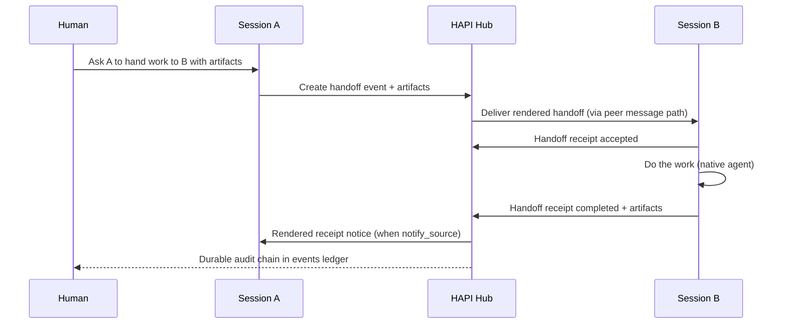

# RFC: HAPI Agent-to-Agent (A2A) Control Plane

> **Status:** draft proposal for upstream discussion
> **Date:** 2026-08-03 (revised 2026-08-04; **Layer 0 peer provenance 2026-08-09; spawn-with-remit + live pressure test 2026-08-12**)
> **Authors:** @heavygee (with community review requested)
> **Related:** [Discussion #1258](https://github.com/tiann/hapi/discussions/1258), [Discussion #1332](https://github.com/tiann/hapi/discussions/1332), [#1195](https://github.com/tiann/hapi/pull/1195), [#1228](https://github.com/tiann/hapi/pull/1228), [#803](https://github.com/tiann/hapi/pull/803), [#1203](https://github.com/tiann/hapi/issues/1203), [#1509](https://github.com/tiann/hapi/issues/1509), [#1370](https://github.com/tiann/hapi/issues/1370), [#1371](https://github.com/tiann/hapi/issues/1371)

---

## Summary

HAPI already lets agents cite, inspect, and message other sessions through the hub. That is useful, but it is still chat. This RFC proposes the next step: a **hub-owned Agent-to-Agent control plane** with:

1. **Artifact-based handoffs** - structured work packages, not endless model chatter
2. **One Boss routing** - all collaboration goes through HAPI so humans retain audit and interrupt control
3. **Unified work advertisements** - a shared way for sessions to declare what they are doing and what they produced

The pragmatic delivery path is layered:

- **Layer 0** already exists upstream (`inspect_peer`, `ping_peer`, session citations)
- **Layer 1** adds a durable cross-session work ledger (`events` / `event_links`) plus typed handoff and work-ad objects
- Later consumers may read that ledger; they are out of scope for this RFC

---

## Motivation

HAPI users increasingly run many sessions in parallel across flavors (Claude Code, Codex, Cursor, Pi, OpenCode, …) and machines. Collaboration today looks like:

- paste a session id
- `ping_peer` with prose instructions
- hope the other agent understands
- dig through chat history later to reconstruct what happened

That works for nudges. It fails for:

- "Claude finished the implementation; send the diff to a local worker for review/tests"
- "Which session owns PR #1234 right now?"
- "Did the handoff complete, block, or vanish into a transcript?"
- "What artifacts were produced, and by whom?"

Vendor stacks will solve these problems inside their own ecosystems. HAPI's opportunity is the **horizontal** path: same collaboration contract across native agents, without forcing every worker into one vendor's cloud.

Layer 0 dogfooding also produced the sharpest argument for structure. [#1370](https://github.com/tiann/hapi/issues/1370) (a pasted session citation does not reliably steer an agent to `inspect_peer` - it searches the local filesystem instead) and [#1371](https://github.com/tiann/hapi/issues/1371) (peer listing behaves differently either side of the hub/runner boundary) are both cases of a collaboration contract that lives only in prompt text and client-side convention. **A contract that agents must infer from prose is not a contract.** Layer 1 puts it in hub-owned objects and gates it on a hub capability, so behavior does not depend on whether a given flavor's system prompt happened to steer correctly.

This RFC is the actionable first brick suggested in [#1258](https://github.com/tiann/hapi/discussions/1258).

---

## Goals

- Typed handoffs between sessions
- Durable cross-session retention of handoffs, ads, and receipts
- One Boss: hub-mediated routing with human audit / interrupt
- Promote worker status into queryable work advertisements
- Keep agent-flavor differences behind adapters
- Remain local-first and single-hub / same-namespace for v1

## Non-goals

The following are **out of scope for Layer 1**, not architectural prohibitions. Layer 1 should leave room for each of them without shipping any:

- Auto-dispatch or standing policies
- Cross-hub organization federation
- Replacing Claude / Codex / Cursor team features
- A fleet-manager UI
- Requiring every agent to emit status lines

---

## Architecture

```text
Worker A  -- cite / inspect / ping -->  Hub control plane  -->  Worker B
                                            |
                                     events ledger
                                            |
                        work ads + handoffs + receipts + links
```

| Layer | What | Status |
|-------|------|--------|
| **0** | Cite, inspect, ping, session summaries | Upstream today |
| **1** | Work ledger + typed A2A objects | This RFC |
| Later | Consumers that read the ledger, including a privileged reader with fleet-wide salience | Out of scope |

Layer 0 remains fully supported. Prose `ping_peer` does not break. Layer 1 adds structure on top.

The ledger is explicitly designed to be read later by a **privileged consumer** - one operating under an accountable principal, with fleet-wide visibility, presenting or acting on work across sessions. This RFC does not design such a consumer and does not require one to exist. It does mean Layer 1 should avoid choices that would foreclose one: see [Bounds](#bounds) and the principal model in [Security and tenancy](#security-and-tenancy).

---

## Layer 0 - already upstream (canon)

These are the A2A substrate that already shipped:

| Primitive | Upstream | Role |
|-----------|----------|------|
| Session UUID + namespace | core | Peer identity |
| `[title](/sessions/<id>)` citations | #1217 / #1228 | Name a peer in text |
| Rich `@` composer chips | #1228 | Human authoring of peer refs |
| `inspect_peer` / `hapi inspect-peer` | #1228 | Read peer metadata + recent text |
| `ping_peer` / `hapi ping-peer` | #1195 | Resume + message a peer |
| `spawn_peer` / `hapi spawn-peer` | **no** ([#1509](https://github.com/tiann/hapi/issues/1509)) | Create a session **with a remit**; fail if empty |
| Flavor system prompts | #1228 | Agents taught: cite → inspect / ping |
| `SessionSummary` | core | Fleet listing fields |
| Multi-flavor / multi-machine | core | Heterogeneous workers and placement |
| Same-hub / same-namespace gate | #1195 | Trust boundary |
| Manual approval on peer tools | Claude MCP | Human interrupt friction |

**Layer 0 truth:** messaging + discovery. Not yet structured collaboration. **Not yet create-with-remit** — machine spawn is an empty shell; that is a Layer 0 hole, not a P1/P2 object ([#1509](https://github.com/tiann/hapi/issues/1509)).

### Revision 2026-08-11 - Layer 0 spawn with remit ([#1509](https://github.com/tiann/hapi/issues/1509))

**Status:** independently shippable Layer 0 primitive. **Not** a Layer 1 work-contract. P2 typed handoffs **call** this; they do not invent a second spawn.

**Problem (observed):** `POST /api/machines/:id/spawn` has no first-prompt field. Extra JSON `message` is stripped. Orchestrators get `sessionId` and zero user turns. `ping_peer` only targets an existing id.

**Contract (Layer 0 only):**

1. CLI `hapi spawn-peer` + MCP `spawn_peer` — same pattern as #1195. Remit required. Fail closed if the new session has no user message.
2. A session-bound / MCP spawn preflights the calling session capability **before** machine spawn. Missing capability returns an error and creates no child.
3. Deliver the remit through the authenticated source-session peer path from #1203 (`POST /cli/sessions/:source/peer-messages`). A spawn remit must not silently downgrade to unattributed `/messages` delivery.
4. Do not auto-approve in read-only/default (#1401 / #1402 class).
5. Do not wait on Hub-as-MCP-server (#360) or `POST /sessions/:parentId/spawn-peer` relocate.

**Kill criteria:** a tool that returns `sessionId` with 0 messages after a remit was supplied → stop. Empty `message` allowed → stop. A missing source capability is discovered only after creating the child → stop. A session-bound spawn falls back to unattributed delivery → stop.

### Revision 2026-08-09 - Layer 0 peer delivery provenance ([#1203](https://github.com/tiann/hapi/issues/1203))

**Status:** independently shippable Layer 0 hardening. **Not** a Layer 1 work-contract / handoff object. Related to A2A because every later handoff *rides* the same delivery path, and today that path lies about authorship.

**Problem (observed):** `ping_peer` POSTs `{ text }` to `POST /api/sessions/:id/messages`. The hub records the row as a normal user message with `meta.sentFrom: "webapp"`. The recipient (agent + human UI) cannot tell peer delivery from operator keystrokes. Prose `From:` headers and AGENTS.md habits are forgeable social convention - useful dogfood, not a contract.

**Contract (Layer 0 only):**

1. When `ping_peer` / `hapi ping-peer` runs inside a wrapped HAPI session, the CLI derives `sourceSessionId` from trusted env (`HAPI_SESSION_ID`) - **never** from a free-form MCP/tool argument.
2. The hub stores peer-delivered messages with machine-readable metadata, additive-only, for example:
   ```json
   {
     "role": "user",
     "meta": {
       "sentFrom": "peer",
       "peer": {
         "sourceSessionId": "<uuid>",
         "sourceName": "<optional metadata.name>"
       }
     }
   }
   ```
3. If invoked outside a session (no trusted sender), still mark delivery as peer/CLI-originated with **unknown** source - never as `sentFrom: "webapp"`.
4. Web UI SHOULD badge peer-originated rows (e.g. "From peer session") and link `/sessions/<sourceSessionId>` when known.
5. Receiving agents MAY reply with `ping_peer` targeting `meta.peer.sourceSessionId`. No automatic reply loop.

**Kill criteria (this slice):**

- Client-supplied `sourceSessionId` in the request body is accepted as authoritative → stop (forged provenance is worse than none).
- A client-settable request header (or any claim not bound to an authenticated source-session channel) is the only gate on that body id → stop. Namespace existence checks are not binding. Prefer hub-derived id from the source session's authenticated CLI/socket path; ignore body id. Bare out-of-session CLI → unattributed peer mark is OK.
- Peer rows remain indistinguishable from operator `webapp` rows in stored `meta` → stop.
- Receiving agents cannot observe `sourceSessionId` (human UI badge alone) → stop for contract item 5 completeness.
- Scope creeps into typed handoff / receipt / ledger write → that is **P2**, not this revision. Plain prose `ping_peer` stays Layer 0; this revision only attributes delivery.

**Relationship to Layer 1 / phases:**

| This revision | P2 handoff |
|---------------|------------|
| Attributes *who delivered a chat nudge* | Creates a durable work-contract with artifacts, receipts, idempotency |
| Lives on `messages.meta` | Lives on `events` / `event_links` |
| Independently useful tomorrow | Requires P1 ledger first |
| Maps later: `session:<sourceSessionId>` can become a principal id on ledger writes | Does not require this meta field, but MUST NOT contradict it |

Phased delivery gains an optional **P0.5** (or "Layer 0.1") row: trusted peer `sentFrom` + UI badge - before or in parallel with P1. Compatibility matrix: cite / inspect / ping remains Layer 0; **attributed ping** is Layer 0 complete, not Layer 1.

**Non-goals for #1203:** automatic replies, cancellation, durable queue, ack protocol, principal/ledger writes, cross-namespace anything.

---

## Layer 1 storage - hub work-graph ledger

Chat transcripts (`messages`) remain the conversation record. A2A needs a second, cross-session ledger.

### Why messages alone are not enough

A `ping_peer` message is retained in the target session transcript. That is archaeology, not a work graph. It cannot reliably answer:

- all handoffs involving a given PR
- current owner of an artifact
- whether a handoff completed or stalled
- what was advertised fleet-wide in the last hour

### Pressure test - 2026-08-12 inline ownership gate

A live ownership gate across three sessions and two machines reproduced the Layer 0 limits:

- `inspect_peer` truncated a long contract, forcing the sender to rewrite it as chat-sized bullets
- an 18 KB artifact written under `/tmp` on the producing machine was not readable by the receiving peer
- delivery had no typed consumed / blocked / completed receipt
- operator-inline traffic needed a distinct authenticated human channel rather than a peer or ghost `webapp` identity

This validates the P1 -> P2 sequence, but sharpens two P2 requirements. A handoff handle must be fetchable by id in P2; waiting for P4 query APIs would leave transcript truncation in the critical path. An `ArtifactRef` must also describe locality and resolvability. A durable pointer to bytes that the receiver cannot access is not a delivered artifact.

### Proposal: `events` + `event_links`

Minimal hub tables (shape intentionally boring and SQLite-native):

```text
events(
  id, ts,
  source_kind, source_ref,
  sink_kind, sink_ref,          -- open vocabularies; see note below
  event_type,
  summary, payload_json,
  artifact_refs,                -- JSON array of ArtifactRef
  tags,                         -- JSON array; grouping without parsing payload_json
  related_session_id,
  related_event_id,             -- weak parent pointer; prefer event_links for typed edges
  provenance,
  idempotency_key, dedupe_key,
  confidence, severity,
  expires_at,                   -- indexed staleness; see WorkAdvertisement
  namespace, principal_json     -- required before any multi-user claims
)

event_links(
  id, from_event_id, to_event_id,
  relation_type,          -- spawned | blocks | blocked_by | resolves | retries | supersedes | duplicates | ...
  created_at, metadata_json
)
```

Three notes on shape:

- **`sink_kind` / `source_kind` are open vocabularies.** v1 needs only `session`. Keeping them open means a future sink (for example a placement request for a session that does not exist yet) is an additive change rather than a redesign.
- **`expires_at` is a column, not a payload field.** Staleness is the single most common filter on a work ad ("what is currently true across the fleet"), and it must be indexable without parsing JSON.
- **`tags` is a column for the same reason** - consumers group and filter without reaching into `payload_json`.

This ledger is the durable home for work ads, handoffs, and receipts. UI for prioritization / management is explicitly deferred.

**Kill criterion:** no multi-user claims until namespace + principal ownership cover every write/query path, with isolation tests.

---

## Core objects

### 1. ArtifactRef

Shared handle to something produced or referenced:

```json
{
  "kind": "github_pr",
  "url": "https://github.com/tiann/hapi/pull/1228",
  "title": "rich composer + inspect_peer",
  "ref": null,
  "source": "worker",
  "created_at": 1785320200000
}
```

Suggested `kind` values: `github_pr`, `github_issue`, `commit`, `branch`, `file_path`, `diff`, `log_url`, `url`, `screenshot`, `session_id`.

Artifact refs are **handles, never payloads**. Secrets must never be embedded; credential references stay elsewhere. Command output, transcripts and diffs are referenced (`log_url`, `file_path`), never inlined - otherwise the ledger becomes both a bloat and a leak surface.

**Locality is part of the handle contract.** A machine-local `file_path` / `diff` must identify its owning machine or session and must not count as accessible to a sink on another machine. Cross-machine handoffs need a sink-resolvable ref such as a PR, commit, or authenticated URL, or a future hub artifact-ingress capability. P2 does not need to invent blob storage, but it must refuse to represent an inaccessible local path as a successfully delivered artifact.

### 2. WorkAdvertisement

A session's claim about current or completed work:

```json
{
  "event_type": "work_ad",
  "related_session_id": "…",
  "summary": "Implementing A2A handoff receipts",
  "expires_at": 1785323800000,
  "payload_json": {
    "status": "in_progress",
    "project": "hapi",
    "confidence": 0.8
  },
  "artifact_refs": []
}
```

Status vocabulary (v1): `in_progress`, `blocked`, `needs_decision`, `done`, `failed`, `stale`, `unknown`.

Work ads are both **session-scoped and project-scoped**: the useful queries are "what is this session doing" and "what is happening on this project right now", and both must be indexed. A single fleet-wide pass over current ads is a first-class query, not a scan.

### 3. HandoffEnvelope

Structured request from one session to another:

```json
{
  "event_type": "handoff",
  "source_ref": "session-a",
  "sink_ref": "session-b",
  "summary": "Review implementation diff and run tests",
  "payload_json": {
    "intent": "review_and_test",
    "instructions": "Focus on regressions in peer messaging.",
    "constraints": ["no_git_push", "read_repo_ok"],
    "notify_source": true,
    "delivery_state": "queued",
    "confirmation": {
      "principal": { "kind": "human", "id": "operator" },
      "source": "human_approved_peer_tool"
    }
  },
  "artifact_refs": [
    { "kind": "diff", "ref": "path/to.patch", "source": "worker" }
  ]
}
```

- **`notify_source`** (default `true`) - when a receipt resolves this handoff, the hub delivers a rendered notice back to the source session over the existing Layer 0 peer path. Without this, a handoff is fire-and-forget: the ledger learns the outcome and the requesting session never does.
- **`delivery_state`** - `queued` | `delivered` | `consumed` | `undeliverable`. Delivery is not consumption; a handoff delivered to a session that then dies mid-turn is a distinct state from one that was never delivered, and retries must be able to tell them apart.
- **`confirmation.source`** - `human_approved_peer_tool` today; see [One Boss rules](#one-boss-rules) for delegated authority.

Delivery still goes through the hub (see flows). The envelope is the durable object; the worker-facing message is a **rendering** of it, not the object itself.

P2 includes a minimal authenticated fetch-by-handoff-id route. The rendered message carries that handle, and the receiving session can fetch the complete envelope without depending on `inspect_peer` transcript limits. P4 adds indexed and fleet-wide queries; it does not defer basic object retrieval.

### 4. HandoffReceipt

Outcome of a handoff:

```json
{
  "event_type": "handoff_receipt",
  "related_event_id": 1234,
  "summary": "Tests passed; two nits noted",
  "payload_json": {
    "status": "completed",
    "notes": "No regressions in ping_peer resolve path.",
    "checks": [
      {
        "command": "npm test -- peer",
        "exit_code": 0,
        "passed": true,
        "started_at": 1785320300000,
        "completed_at": 1785320480000,
        "output_ref": { "kind": "log_url", "url": "…" }
      }
    ]
  },
  "artifact_refs": [
    { "kind": "log_url", "url": "…", "source": "worker" }
  ]
}
```

Receipt statuses (v1): `accepted`, `rejected`, `completed`, `incomplete`, `blocked`, `failed`.

- **`incomplete`** means "no terminal evidence yet - inspect the target session before deciding". A completion timeout is not a failure: some agent turns are legitimately long. Without this status the vocabulary forces a false choice between `blocked` and `failed`, and silence gets recorded as a verdict.
- **`checks[]`** is optional and carries **facts, not judgements**: a command, its exit code, and a reference to its output. A verifier's opinion belongs in `notes`. This is the difference between a receipt that says *an agent reported tests passed* and one that says *this command exited 0 at this time, output here* - which is the whole point of a review-and-test handoff. Output is referenced, never inlined.

Link the receipt to the handoff with `event_links.relation_type = resolves` (or `blocked_by` when blocked).

**A late receipt is still valid.** If a timeout notice already went out and the target later finishes, its receipt links `resolves` as normal and must not be dropped. Retries are new events linked with `retries` / `supersedes` - never overwrites of a prior attempt.

---

## `AGENT_NOTIFY_SUMMARY` elevation

### Current upstream reality

Upstream already recognizes a trailing status line:

```text
AGENT_NOTIFY_SUMMARY {"version":1,"status":"done","action":"…","summary":"…"}
```

It landed with native companion / FCM ([#803](https://github.com/tiann/hapi/pull/803)) as **optional notification enrichment**. The parser lives in `@hapi/protocol` (`extractNotifySummary`). Agents are not required to emit it.

### Proposal

Promote this format from "nicer push body" to **best-effort worker status emission** for the A2A ledger:

| Notify field | Maps toward |
|--------------|-------------|
| `status` | WorkAd / receipt status |
| `summary` | event summary |
| `action` | suggested next human/agent action (advisory) |
| `agent` / `project` | provenance / grouping |

Rules:

- Emission remains **optional by default, and should stay optional indefinitely**. Missing status is not failure: it leaves a work ad `unknown`, and eventually `stale` via `expires_at`. Treating silence as a verdict is the same mistake as treating timeout as failure.
- Invalid lines stay ignored (current parser behavior)
- A session or estate may opt into a required status protocol later

This avoids inventing a second worker status dialect. Note the deliberate division of labour with receipt `checks[]`: the notify line is a **self-report** (what the agent believes about its turn), `checks[]` is **machine fact** (what a command actually returned). Both are structured sidecars condensed for humans and durable for machines; only one is evidence.

---

## Protocols / flows

### Happy path: human-directed handoff



### What the worker actually sees

The worker-facing message renders `summary`, `intent`, `constraints`, `instructions` (verbatim), the artifact list, and a hub-issued handle for the handoff event. The rest of the envelope stays in the ledger and can be fetched through the query API.

This is a boundary, not concealment - the worker can retrieve everything. Four reasons it matters:

1. **A rendered `confirmation` block is a forgeable badge.** If the worker reads `principal: operator, source: human_approved_peer_tool` as prompt text, then any writer who can create an event can write their own confirmation block and have it read as a grant. Authority is established by the hub at delivery time; a worker should never be in a position to *read* its own authorization.
2. **Attribution collapses.** Inlined, a worker cannot distinguish "the hub asserts this" from "the sender claimed this". Retrieved, that distinction is structural.
3. **Signal dilution.** Envelope metadata will grow. An agent handed sixty lines of control metadata and three lines of instruction follows the metadata's shape - the observed failure mode in #1370.
4. **Rendering must version independently of storage.** As a projection, the ledger can gain fields without changing what any agent sees, across hub/runner version skew that is otherwise untestable.

Hub-owned mutable fields (`delivery_state`, `expires_at`, `confidence`) are additionally unsafe to inline because a rendered copy is stale the moment it is read.

### Artifact review example

1. Session A (e.g. Claude Code) finishes an implementation
2. A creates a `handoff` with `diff` / `github_pr` artifact refs
3. Hub delivers to Session B (e.g. local coding worker)
4. B inspects artifacts, runs tests, writes `handoff_receipt` with `checks[]`
5. Hub notifies A that the handoff resolved
6. Humans (or later consumers) query the ledger by PR / session / status

### Discover → inspect → handoff → receipt

1. **Discover** - session list / summaries + work ads
2. **Inspect** - `inspect_peer` and/or event query by session or artifact
3. **Handoff** - write envelope event; deliver via hub
4. **Act** - receiver works under its native flavor
5. **Receipt** - write outcome + artifacts (+ notice back to source)
6. **Audit** - follow `event_links`

Layer 0 tools remain the human/agent UX for read/nudge. Layer 1 makes the collaboration reconstructible.

---

## One Boss rules

1. **All A2A through the hub** - no agent-to-agent side channels
2. **Same hub + same namespace only (v1)**
3. **Every worker-facing message is attributable to a principal, and every non-human principal resolves to a human owner.** The hub is the router; authority terminates in an accountable human. (This is deliberately stronger than "messages are human-attributed": it admits an agent or service principal acting under a recorded grant, while refusing an action whose audit chain ends at "an agent said so".)
4. **Humans can interrupt** - peer tools may require approval; delivery can be denied
5. **Authorization at action time** - untrusted content (peer text, issue comments, MCP output, artifact metadata) must not become instruction authority merely by being stored or summarized
6. **Idempotent writes** - retries must not create duplicate handoffs
7. **Flavor adapters report facts; the hub owns policy and vocabulary.** An adapter may emit only observations - a notify line, a turn ended, a session unreachable, a process exit. The hub alone maps facts onto the status vocabulary. No flavor's internal state names may appear in `event_type` or any status field.

Rule 7 is what keeps "keep native agents native" ([#1258](https://github.com/tiann/hapi/discussions/1258)) true structurally rather than aspirationally, and it is also what keeps A2A transport-neutral: several flavors reach HAPI over ACP today and several do not, so handoff semantics must never be expressed in any single backend's terms.

Operator-inline / dock traffic is an adjacent authenticated human channel, not a peer event type and not a `webapp` compatibility fallback. This RFC does not design that transport, but its principal and channel vocabulary must represent the operator without laundering the message through peer provenance. Authority still terminates at that human principal.

### Bounds

Worker sessions may read only hub-owned data about peers they are permitted to see, and may not use the ledger as a self-service work queue. There is no polling for work, and no wake-up that is not hub-mediated and attributable to a principal.

The ledger is nevertheless designed to be read by a privileged consumer with fleet-wide salience, operating under an accountable principal. That consumer's design is out of scope here; the bounds above constrain **unprivileged worker sessions**, which is where confused-deputy risk actually lives.

These rules are the product difference versus "agents DMing each other."

---

## API surface (proposed)

Exact routes can bikeshed; the capabilities matter:

| Capability | Proposal |
|------------|----------|
| Write event | authenticated hub write with schema validation + idempotency |
| Fetch event / handoff by id | authenticated same-namespace read; required with P2 rendered handles |
| Query events | filter by session, project, type, artifact, tag, time, status, staleness |
| Create handoff | **dedicated helper** that writes `handoff`, creates links, and delivers - atomically |
| Write receipt | binds to handoff via `event_links`; delivers notice to source when `notify_source` |
| Compatibility | `ping_peer` may emit a `handoff` when message/payload matches envelope schema |

Handoff creation is a dedicated route rather than "compose `create event` + `ping_peer`" because idempotency, link creation and delivery have to succeed or fail together. Composed from two calls, a client crash between them yields a delivered instruction with no ledger row, or a ledger row nobody received.

Two queries are first-class, indexed, and not filter-scans:

- **by artifact** - "which handoffs and ads touch PR #1234" answers the ownership question from Motivation
- **fleet-wide current ads** - one pass over unexpired work ads across sessions

Backward compatible default:

- plain prose `ping_peer` → Layer 0 only (message retained in transcript)
- structured handoff → Layer 0 delivery **plus** Layer 1 ledger row

---

## Security and tenancy

- Namespace isolation on every event write/query
- **Principal recorded on every write, structured:** `{ kind: "human" | "agent" | "service", id, on_behalf_of }`. A non-human principal must carry an accountable human owner. A bare string cannot express "CI wrote this under my grant" without lying about one of the two.
- **Delegated authority is explicit.** `confirmation.source` may be `human_approved_peer_tool` (a human approved this specific action) or `delegated_authority` with a `granting_event_id` pointing at the event that recorded the grant. Every delegated action's audit chain terminates at a human grant.
- Artifact refs are handles, never secret material
- Peer tools stay same-hub / same-namespace
- Prompt-injection / confused-deputy tests before any auto-actuation claims
- Any privileged reader must treat ledger content as **data**, never as instruction authority, and must obtain fresh authorization for its own actions (rule 5 applies to consumers, not just workers)

**Kill criteria**

- Cross-namespace read or write possible → stop
- Duplicate handoffs on retry → stop
- Untrusted stored text can broaden action scope without fresh authorization → stop
- A non-human principal can act with no resolvable human owner → stop

---

## Compatibility matrix

| Capability | Upstream today | This RFC |
|------------|----------------|----------|
| cite / inspect / ping | yes | canon as Layer 0 |
| spawn peer **with remit** | no (#1509) | Layer 0 gap — MCP `spawn_peer` + CLI; fail-closed |
| attributed peer delivery (`sentFrom: peer`) | no (#1203) | Layer 0.1 / P0.5 - not a handoff |
| message retention | yes | remains |
| `AGENT_NOTIFY_SUMMARY` parse | yes (#803) | elevate to work-ad feed |
| cross-session events ledger | no | add |
| typed handoff + receipt | no | add |
| work advertisements | no (chat only) | add |

### Wire contract

Schemas are **additive-only**, not frozen - freezing is not achievable across independently updated hub, runner and app:

- New fields are optional with a sensible default
- Never narrow a type, never flip optional to required, never remove a field. A field you stop writing stays readable.
- The feature is gated on a **hub capability flag**. An old runner or app does not get a degraded simulation of Layer 1; it simply does not offer it.
- Every compatibility shim is tagged with a name, the version it arrived in, and a removal condition, so the cleanup backlog is greppable.

Two questions before any schema change lands: does a six-month-old client still parse this, and does a six-month-old hub still send something this client accepts?

This matters here specifically because [#1371](https://github.com/tiann/hapi/issues/1371) is a hub/runner skew bug. A new collaboration contract that depends on both sides being current would reproduce it by design.

---

## Phased delivery

| Phase | Deliverable |
|-------|-------------|
| **P0** | This RFC + additive-only object schemas + capability flag |
| **P0.4** | Layer 0 spawn with remit ([#1509](https://github.com/tiann/hapi/issues/1509)) - MCP `spawn_peer` + CLI; fail-closed. Not a work-contract. |
| **P0.5** | Layer 0 peer delivery provenance ([#1203](https://github.com/tiann/hapi/issues/1203)) - trusted `meta.sentFrom: "peer"` + source session; UI badge. Not a work-contract. |
| **P1** | `events` / `event_links` + namespace/principal ownership + isolation tests |
| **P2** | Handoff create / deliver / fetch-by-id / receipt (+ notice back to source); enforce artifact locality |
| **P3** | `AGENT_NOTIFY_SUMMARY` → work-ad / status ingest |
| **P4** | Query APIs + minimal debug surfaces (no manager UI) |

Each phase should be independently useful. P0.4 without P1 still lets an agent create a worker with work. P0.5 without P1 still stops ghost user messages. P1 without P2 still gives a place to put structured status. P2 without P3 still gives explicit handoffs.

The smallest useful upstream slice is **P1 alone**: tables, write/query, structured principal, namespace isolation tests - no handoff helper, no UI.

P4's debug surface is an API plus one read-only JSON route. Not a panel.

---

## Acceptance tests

- Handoff remains queryable after both sessions are archived
- A rendered handoff handle retrieves the complete envelope without reading the source transcript
- Artifact refs survive and can be listed by PR / commit / path
- A machine-local artifact ref records its locality and cannot be reported accessible to a cross-machine sink
- Query by artifact (`github_pr`) returns every handoff and ad touching that PR
- Retry with same idempotency key does not duplicate handoff
- Retry after a failed delivery creates a new linked event (`retries`), never overwrites the prior one
- Two concurrent handoffs to the same busy session are both retained and individually resolvable
- A receipt arriving after a timeout notice still links `resolves` and is not dropped
- Receipt `checks[]` round-trips with output as refs and no secret material
- Cross-namespace handoff is refused
- A write whose principal is non-human with no resolvable human owner is refused
- Valid `AGENT_NOTIFY_SUMMARY` can promote into a work-ad / status event
- Invalid notify line is ignored (no crash, no bogus event)
- Plain prose `ping_peer` still works unchanged
- Peer-delivered messages store `meta.sentFrom: "peer"` (never `webapp`); when `HAPI_SESSION_ID` is set, `meta.peer.sourceSessionId` matches that id and is not client-forgeable
- Request bodies that invent `sourceSessionId` are ignored or rejected (hub derives sender)
- Event query by `related_session_id` returns that session's A2A history
- An old client without the capability flag neither offers nor breaks on Layer 1

---

## Open questions

1. Should `delivery_state` transitions be hub-inferred (turn boundaries, session reachability) or explicitly acknowledged by the receiving session?
2. Does `work_ad` need an explicit supersede rule, or is `expires_at` plus latest-per-session sufficient?
3. How should a handoff to an unreachable or archived session resolve - `undeliverable` receipt, or no receipt and a stale handoff?
4. Should the artifact index be a derived table, or is querying `artifact_refs` JSON acceptable at expected volumes?
5. Is `tags` the right grouping primitive, or should project be a first-class column given how often ads are project-scoped?

Resolved since the first draft, recorded here so the reasoning is not relitigated: notify-summary stays optional indefinitely; the `event_type` vocabulary stays at `work_ad` / `handoff` / `handoff_receipt`; handoff creation gets a dedicated route; work ads are both session- and project-scoped; the worker-facing message is a projection rather than the payload.

---

## Appendix A - mapping to the three asks from #1258

| Ask | This RFC |
|-----|----------|
| Artifact-based handoffs | `HandoffEnvelope` + `ArtifactRef` + receipts with `checks[]` |
| One Boss via HAPI | hub-only routing, principal attribution, interruptible peer tools |
| Unified work advertisements | `WorkAdvertisement` + notify-summary elevation |

## Appendix B - related upstream work

- [#1194](https://github.com/tiann/hapi/issues/1194) / [#1195](https://github.com/tiann/hapi/pull/1195) - `ping_peer`
- [#1246](https://github.com/tiann/hapi/issues/1246) / [#1228](https://github.com/tiann/hapi/pull/1228) - `inspect_peer` + rich session mentions
- [#1215](https://github.com/tiann/hapi/issues/1215) / [#1217](https://github.com/tiann/hapi/pull/1217) - session `@` citations
- [#803](https://github.com/tiann/hapi/pull/803) - `AGENT_NOTIFY_SUMMARY` parse for FCM
- [#1370](https://github.com/tiann/hapi/issues/1370) - citation → `inspect_peer` steering
- [#1371](https://github.com/tiann/hapi/issues/1371) - peer listing across the hub/runner boundary
- [#1258](https://github.com/tiann/hapi/discussions/1258) - strategic discussion that requested this RFC

## Appendix C - non-normative example chain

```text
work_ad(session A, in_progress, "impl peer handoff")
handoff(A → B, review_and_test, artifact=diff)
handoff_receipt(B, accepted)
handoff_receipt(B, completed, artifact=log, checks=[npm test → 0])
work_ad(session A, done, artifact=github_pr)
event_links: handoff --spawned--> receipt*; receipt --resolves--> handoff
```

## Appendix D - prior art

Assessed from primary sources (repos, design docs, public product docs) so this RFC is not reinventing existing work. Thanks to @KorenKrita in [#1258](https://github.com/tiann/hapi/discussions/1258) for the pointers.

| | [Paseo](https://github.com/getpaseo/paseo) | [CCB](https://github.com/SeemSeam/claude_codex_bridge) | [Lody](https://lody.ai/) (closed) |
|---|---|---|---|
| Shape | local daemon + desktop/mobile/web/CLI clients | visible multi-agent terminal panes + daemon | local CLI + hosted team workspace |
| A2A primitive | cross-provider subagents via injected tool catalog | `/ask <agent>` between panes | agent creates/inspects/follows-up other conversations |
| Artifact handoff | prose briefing template (a *skill*, not a schema) | shared memory `.md` + payload refs | shared session context + linked PR |
| Receipts | `notifyOnFinish` callback; `Loop` records carry verify-check results with exit codes | `ReplyRecord` + terminal status, with attempt lineage | results return to the requesting conversation |
| Durable work graph | none (agent records, chat rooms, loops, schedules) | messages / attempts / replies + dead-letter (design doc) | not public |
| Audit surface | Subagents track in the app | watch the pane and take over | shared team workspace |

What this RFC takes from them: the requester must be notified when delegated work resolves (all three); delivery, attempt and reply are distinct with retry lineage (CCB); timeout means inspect rather than fail (CCB, Lody); receipts should carry machine evidence, not assertions (Paseo `Loop` verify checks); provider facts must not leak into user-visible state vocabulary (CCB, Paseo); wire schemas are additive with capability gating (Paseo).

What it deliberately does not take: injecting a central capability catalog into every agent (fights "keep native agents native" - #1258); parent-owns-child lifecycle for peer sessions; coordination contracts that live in prompt templates rather than stored objects (#1370); a full mailbox scheduler with leases, quorum and priority classes; cloud/team tenancy models; pane-visibility as the audit mechanism; and any requirement that a worker's runtime speak one particular protocol to participate.

Notably, **none of the three has a typed artifact object or a fleet-wide work-advertisement object.** Those two remain this RFC's differentiated - and therefore least externally validated - parts, which argues for keeping them small in v1.

---

## Ask to the community

Looking for feedback on:

1. Does Layer 0 → Layer 1 sequencing feel right?
2. Is elevating `AGENT_NOTIFY_SUMMARY` acceptable, or should status ads use a new object?
3. Is P1-alone (tables + write/query + isolation tests) the right first upstream PR?
4. Any hard constraints from existing hub/SQLite / namespace design we should bake into P1?
5. Is the structured `principal` shape right, or does upstream already have a convention to reuse?

If this direction looks good, next step is a thin P1 implementation PR: ledger schema + write/query + isolation tests, with no manager UI.
