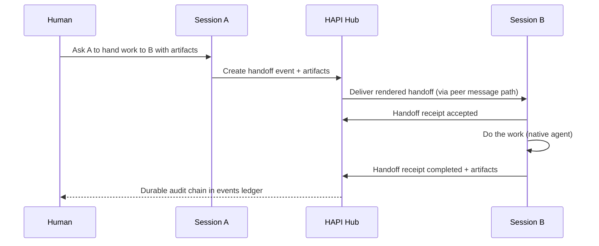

# RFC: HAPI Agent-to-Agent (A2A) Control Plane

> **Status:** draft proposal for upstream discussion
> **Date:** 2026-08-03
> **Authors:** @heavygee (with community review requested)
> **Related:** [Discussion #1258](https://github.com/tiann/hapi/discussions/1258), [#1195](https://github.com/tiann/hapi/pull/1195), [#1228](https://github.com/tiann/hapi/pull/1228), [#803](https://github.com/tiann/hapi/pull/803)

---

## Summary

HAPI already lets agents cite, inspect, and message other sessions through the hub. That is useful, but it is still chat. This RFC proposes the next step: a **hub-owned Agent-to-Agent control plane** with:

1. **Artifact-based handoffs** - structured work packages, not endless model chatter
2. **One Boss routing** - all collaboration goes through HAPI so humans retain audit and interrupt control
3. **Unified work advertisements** - a shared way for sessions to declare what they are doing and what they produced

The pragmatic delivery path is layered:

- **Layer 0** already exists upstream (`inspect_peer`, `ping_peer`, session citations)
- **Layer 1** adds a durable cross-session work ledger (`events` / `event_links`) plus typed handoff and work-ad objects
- Later consumers may read that ledger; they are out of scope for this RFC

---

## Motivation

HAPI users increasingly run many sessions in parallel across flavors (Claude Code, Codex, Cursor, Pi, OpenCode, …) and machines. Collaboration today looks like:

- paste a session id
- `ping_peer` with prose instructions
- hope the other agent understands
- dig through chat history later to reconstruct what happened

That works for nudges. It fails for:

- "Claude finished the implementation; send the diff to a local worker for review/tests"
- "Which session owns PR #1234 right now?"
- "Did the handoff complete, block, or vanish into a transcript?"
- "What artifacts were produced, and by whom?"

Vendor stacks will solve these problems inside their own ecosystems. HAPI's opportunity is the **horizontal** path: same collaboration contract across native agents, without forcing every worker into one vendor's cloud.

This RFC is the actionable first brick suggested in [#1258](https://github.com/tiann/hapi/discussions/1258).

---

## Goals

- Typed handoffs between sessions
- Durable cross-session retention of handoffs, ads, and receipts
- One Boss: hub-mediated routing with human audit / interrupt
- Promote worker status into queryable work advertisements
- Keep agent-flavor differences behind adapters
- Remain local-first and single-hub / same-namespace for v1

## Non-goals

- Auto-dispatch or standing policies
- Cross-hub organization federation
- Replacing Claude / Codex / Cursor team features
- Shipping a fleet-manager UI in this RFC
- Requiring every agent to emit status lines on day one

---

## Architecture

```text
Worker A  -- cite / inspect / ping -->  Hub control plane  -->  Worker B
                                            |
                                     events ledger
                                            |
                        work ads + handoffs + receipts + links
```

| Layer | What | Status |
|-------|------|--------|
| **0** | Cite, inspect, ping, session summaries | Upstream today |
| **1** | Work ledger + typed A2A objects | This RFC |
| Later | Any consumer that reads the ledger | Out of scope |

Layer 0 remains fully supported. Prose `ping_peer` does not break. Layer 1 adds structure on top.

---

## Layer 0 - already upstream (canon)

These are the A2A substrate that already shipped:

| Primitive | Upstream | Role |
|-----------|----------|------|
| Session UUID + namespace | core | Peer identity |
| `[title](/sessions/<id>)` citations | #1217 / #1228 | Name a peer in text |
| Rich `@` composer chips | #1228 | Human authoring of peer refs |
| `inspect_peer` / `hapi inspect-peer` | #1228 | Read peer metadata + recent text |
| `ping_peer` / `hapi ping-peer` | #1195 | Resume + message a peer |
| Flavor system prompts | #1228 | Agents taught: cite → inspect / ping |
| `SessionSummary` | core | Fleet listing fields |
| Multi-flavor / multi-machine | core | Heterogeneous workers and placement |
| Same-hub / same-namespace gate | #1195 | Trust boundary |
| Manual approval on peer tools | Claude MCP | Human interrupt friction |

**Layer 0 truth:** messaging + discovery. Not yet structured collaboration.

---

## Layer 1 storage - hub work-graph ledger

Chat transcripts (`messages`) remain the conversation record. A2A needs a second, cross-session ledger.

### Why messages alone are not enough

A `ping_peer` message is retained in the target session transcript. That is archaeology, not a work graph. It cannot reliably answer:

- all handoffs involving a given PR
- current owner of an artifact
- whether a handoff completed or stalled
- what was advertised fleet-wide in the last hour

### Proposal: `events` + `event_links`

Minimal hub tables (shape intentionally boring and SQLite-native):

```text
events(
  id, ts,
  source_kind, source_ref,
  sink_kind, sink_ref,
  event_type,
  summary, payload_json,
  artifact_refs,          -- JSON array of ArtifactRef
  related_session_id,
  related_event_id,       -- weak parent pointer; prefer event_links for typed edges
  provenance,
  idempotency_key, dedupe_key,
  confidence, severity,
  namespace, principal     -- required before any multi-user claims
)

event_links(
  id, from_event_id, to_event_id,
  relation_type,          -- spawned | blocks | blocked_by | resolves | duplicates | ...
  created_at, metadata_json
)
```

This ledger is the durable home for work ads, handoffs, and receipts. UI for prioritization / management is explicitly deferred.

**Kill criterion:** no multi-user claims until namespace + principal ownership cover every write/query path, with isolation tests.

---

## Core objects

### 1. ArtifactRef

Shared handle to something produced or referenced:

```json
{
  "kind": "github_pr",
  "url": "https://github.com/tiann/hapi/pull/1228",
  "title": "rich composer + inspect_peer",
  "ref": null,
  "source": "worker",
  "created_at": 1785320200000
}
```

Suggested `kind` values: `github_pr`, `github_issue`, `commit`, `branch`, `file_path`, `diff`, `log_url`, `url`, `screenshot`, `session_id`.

Secrets must never be embedded. Credential references stay elsewhere.

### 2. WorkAdvertisement

A session's claim about current or completed work:

```json
{
  "event_type": "work_ad",
  "related_session_id": "…",
  "summary": "Implementing A2A handoff receipts",
  "payload_json": {
    "status": "in_progress",
    "project": "hapi",
    "fresh_until": 1785323800000,
    "confidence": 0.8
  },
  "artifact_refs": []
}
```

Status vocabulary (v1): `in_progress`, `blocked`, `needs_decision`, `done`, `failed`, `stale`, `unknown`.

### 3. HandoffEnvelope

Structured request from one session to another:

```json
{
  "event_type": "handoff",
  "source_ref": "session-a",
  "sink_ref": "session-b",
  "summary": "Review implementation diff and run tests",
  "payload_json": {
    "intent": "review_and_test",
    "instructions": "Focus on regressions in peer messaging.",
    "constraints": ["no_git_push", "read_repo_ok"],
    "confirmation": {
      "principal": "operator",
      "source": "human_approved_peer_tool"
    }
  },
  "artifact_refs": [
    { "kind": "diff", "ref": "path/to.patch", "source": "worker" }
  ]
}
```

Delivery still goes through the hub (see flows). The envelope is the durable object; the worker-facing message is a rendering of it.

### 4. HandoffReceipt

Outcome of a handoff:

```json
{
  "event_type": "handoff_receipt",
  "related_event_id": 1234,
  "summary": "Tests passed; two nits noted",
  "payload_json": {
    "status": "completed",
    "notes": "No regressions in ping_peer resolve path."
  },
  "artifact_refs": [
    { "kind": "log_url", "url": "…", "source": "worker" }
  ]
}
```

Receipt statuses (v1): `accepted`, `rejected`, `completed`, `blocked`, `failed`.

Link the receipt to the handoff with `event_links.relation_type = resolves` (or `blocked_by` when blocked).

---

## `AGENT_NOTIFY_SUMMARY` elevation

### Current upstream reality

Upstream already recognizes a trailing status line:

```text
AGENT_NOTIFY_SUMMARY {"version":1,"status":"done","action":"…","summary":"…"}
```

It landed with native companion / FCM ([#803](https://github.com/tiann/hapi/pull/803)) as **optional notification enrichment**. The parser lives in `@hapi/protocol` (`extractNotifySummary`). Agents are not required to emit it.

### Proposal

Promote this format from "nicer push body" to **best-effort worker status emission** for the A2A ledger:

| Notify field | Maps toward |
|--------------|-------------|
| `status` | WorkAd / receipt status |
| `summary` | event summary |
| `action` | suggested next human/agent action (advisory) |
| `agent` / `project` | provenance / grouping |

Rules:

- Emission remains **optional by default**
- A session or estate may opt into required status protocol later
- Missing summary ≠ failed task; it may leave a work ad `unknown` / eventually `stale`
- Invalid lines stay ignored (current parser behavior)

This avoids inventing a second worker status dialect while still making the existing format useful beyond FCM.

---

## Protocols / flows

### Happy path: human-directed handoff



### Artifact review example

1. Session A (e.g. Claude Code) finishes an implementation
2. A creates a `handoff` with `diff` / `github_pr` artifact refs
3. Hub delivers to Session B (e.g. local coding worker)
4. B inspects artifacts, runs tests, writes `handoff_receipt`
5. Humans (or later automation) query the ledger by PR / session / status

### Discover → inspect → handoff → receipt

1. **Discover** - session list / summaries + work ads
2. **Inspect** - `inspect_peer` and/or event query by session or artifact
3. **Handoff** - write envelope event; deliver via hub
4. **Act** - receiver works under its native flavor
5. **Receipt** - write outcome + artifacts
6. **Audit** - follow `event_links`

Layer 0 tools remain the human/agent UX for read/nudge. Layer 1 makes the collaboration reconstructible.

---

## One Boss rules

1. **All A2A through the hub** - no agent-to-agent side channels
2. **Same hub + same namespace only (v1)**
3. **Worker-facing messages remain human-attributed** - the hub is the router; authority stays with the human principal
4. **Humans can interrupt** - peer tools may require approval; delivery can be denied
5. **Authorization at action time** - untrusted content (peer text, issue comments, MCP output, artifact metadata) must not become instruction authority merely by being stored or summarized
6. **Idempotent writes** - retries must not create duplicate handoffs

These rules are the product difference versus "agents DMing each other."

---

## API surface (proposed)

Exact routes can bikeshed; the capabilities matter:

| Capability | Proposal |
|------------|----------|
| Write event | authenticated hub write with schema validation + idempotency |
| Query events | filter by session, type, artifact, time, status |
| Create handoff | helper that writes `handoff` and delivers to target session |
| Write receipt | binds to handoff via `event_links` |
| Compatibility | `ping_peer` may emit a `handoff` when message/payload matches envelope schema |

Backward compatible default:

- plain prose `ping_peer` → Layer 0 only (message retained in transcript)
- structured handoff → Layer 0 delivery **plus** Layer 1 ledger row

---

## Security and tenancy

- Namespace isolation on every event write/query
- Principal recorded on every write
- Artifact refs are handles, never secret material
- Peer tools stay same-hub / same-namespace
- Prompt-injection / confused-deputy tests before any auto-actuation claims

**Kill criteria**

- Cross-namespace read or write possible → stop
- Duplicate handoffs on retry → stop
- Untrusted stored text can broaden action scope without fresh authorization → stop

---

## Compatibility matrix

| Capability | Upstream today | This RFC |
|------------|----------------|----------|
| cite / inspect / ping | yes | canon as Layer 0 |
| message retention | yes | remains |
| `AGENT_NOTIFY_SUMMARY` parse | yes (#803) | elevate to work-ad feed |
| cross-session events ledger | no | add |
| typed handoff + receipt | no | add |
| work advertisements | no (chat only) | add |

---

## Phased delivery

| Phase | Deliverable |
|-------|-------------|
| **P0** | This RFC + frozen object schemas |
| **P1** | `events` / `event_links` + namespace/principal ownership + tests |
| **P2** | Handoff create / deliver / receipt |
| **P3** | `AGENT_NOTIFY_SUMMARY` → work-ad / status ingest |
| **P4** | Query APIs + minimal debug surfaces (no full manager UI) |

Each phase should be independently useful. P1 without P2 still gives a place to put structured status. P2 without P3 still gives explicit handoffs.

---

## Acceptance tests

- Handoff remains queryable after both sessions are archived
- Artifact refs survive and can be listed by PR / commit / path
- Retry with same idempotency key does not duplicate handoff
- Cross-namespace handoff is refused
- Valid `AGENT_NOTIFY_SUMMARY` can promote into a work-ad / status event
- Invalid notify line is ignored (no crash, no bogus event)
- Plain prose `ping_peer` still works unchanged
- Event query by `related_session_id` returns that session's A2A history

---

## Open questions

1. Dedicated handoff route vs compose `create event` + existing peer delivery?
2. Should notify-summary stay optional forever, or become opt-in-required per session?
3. How much of the envelope is rendered into the worker-facing message vs hub-only?
4. Are work ads primarily session-scoped, project-scoped, or both?
5. Ship API-only first, or include a tiny debug panel in P4?
6. Exact `event_type` vocabulary: keep small (`work_ad`, `handoff`, `handoff_receipt`) or start wider?

---

## Appendix A - mapping to the three asks from #1258

| Ask | This RFC |
|-----|----------|
| Artifact-based handoffs | `HandoffEnvelope` + `ArtifactRef` + receipts |
| One Boss via HAPI | hub-only routing, human attribution, interruptible peer tools |
| Unified work advertisements | `WorkAdvertisement` + notify-summary elevation |

## Appendix B - related upstream work

- [#1194](https://github.com/tiann/hapi/issues/1194) / [#1195](https://github.com/tiann/hapi/pull/1195) - `ping_peer`
- [#1246](https://github.com/tiann/hapi/issues/1246) / [#1228](https://github.com/tiann/hapi/pull/1228) - `inspect_peer` + rich session mentions
- [#1215](https://github.com/tiann/hapi/issues/1215) / [#1217](https://github.com/tiann/hapi/pull/1217) - session `@` citations
- [#803](https://github.com/tiann/hapi/pull/803) - `AGENT_NOTIFY_SUMMARY` parse for FCM
- [#1258](https://github.com/tiann/hapi/discussions/1258) - strategic discussion that requested this RFC

## Appendix C - non-normative example chain

```text
work_ad(session A, in_progress, "impl peer handoff")
handoff(A → B, review_and_test, artifact=diff)
handoff_receipt(B, accepted)
handoff_receipt(B, completed, artifact=log)
work_ad(session A, done, artifact=github_pr)
event_links: handoff --spawned--> receipt*; receipt --resolves--> handoff
```

---

## Ask to the community

Looking for feedback on:

1. Does Layer 0 → Layer 1 sequencing feel right?
2. Is elevating `AGENT_NOTIFY_SUMMARY` acceptable, or should status ads use a new object?
3. Smallest useful P1/P2 slice for an upstream PR?
4. Any hard constraints from existing hub/SQLite / namespace design we should bake into P1?

If this direction looks good, next step is a thin P1 implementation PR: ledger schema + write/query + isolation tests, with no manager UI.
