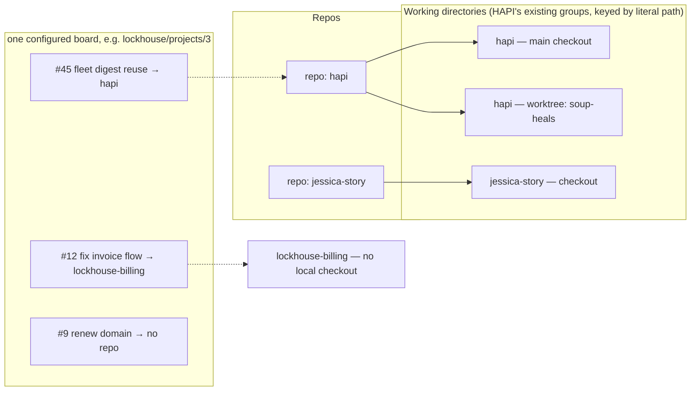
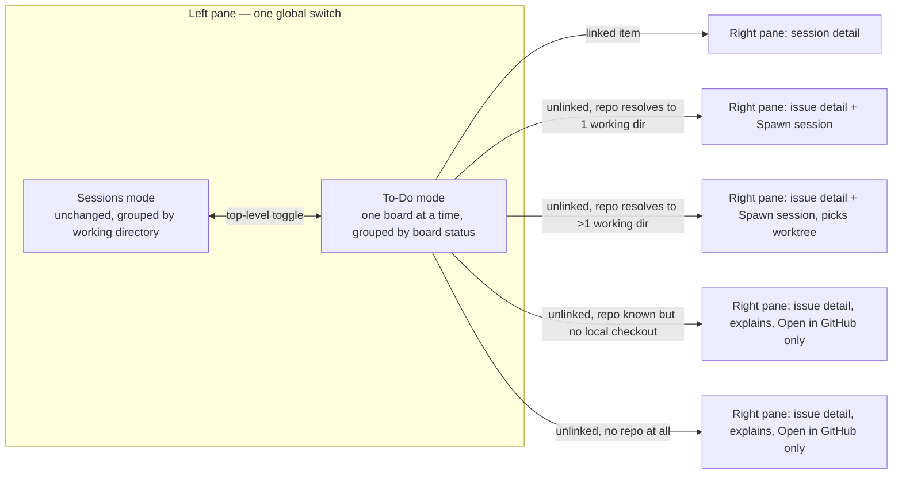
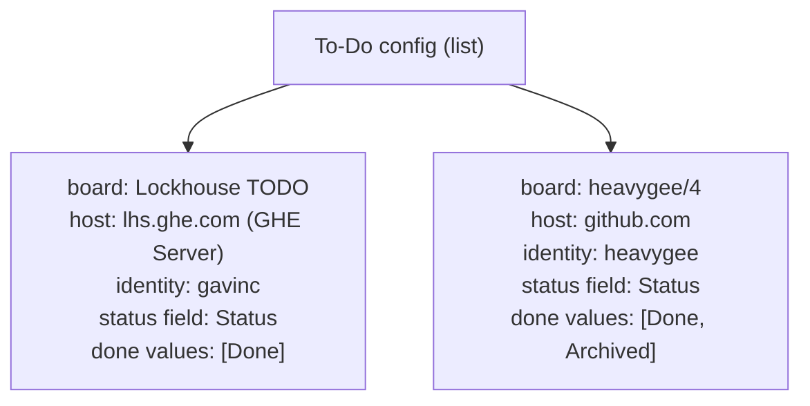

# To-Do / board view in HAPI — design

Status: draft, cold-read complete, corrections applied, filing as tracking + 4 child issues.

## Problem

The operator's task list lives in GitHub (Projects v2 boards), not in HAPI, which means leaving HAPI to find out what's next. HAPI already groups sessions by project; this proposes a second, independent mode that surfaces board items the same way, with cross-links to sessions where they exist.

## Terminology (previously conflated as "project")

- **Repo** — a GitHub repository.
- **Working directory** — one of HAPI's existing session groups. Confirmed in code: `groupSessionsByDirectory` (`web/src/components/SessionList.tsx:334`) keys purely on the literal filesystem `directory` path (`${machineId}::${path}`, path from `worktree.basePath ?? path`), plus `machineId`. A repo with a main checkout and two worktrees is **three** working directories, not one.
- **Board** — a GitHub Project (v2). Many-to-many with repo: a board can span repos, or contain items with no repo at all (personal/life tasks). Independent axis from working directory.

A single board does not map onto a single working directory, and most items on a personal board may have no repo relationship at all. This must not be treated as a degenerate edge case — for at least one of the operator's two real boards, it's the common case.

## Prior art this extends (corrected after cold read)

`tiann/hapi#1160`/`#1161`/`#1162`/`#1163` are all still **open/unmerged on upstream main** — nothing in that chain has landed. The PR-chip mechanism described below is not settled upstream convention; it's **this fork's own in-flight dogfood pattern**, running on the daily-driver soup build (`driver/shared/src/schemas.ts`, `hub/src/configuration.ts`, `cli/src/commands/linkPr.ts`, `web/.../SessionPrChip.tsx` + `LinkPrDialog.tsx`) ahead of upstream merge. Treat it as "what the fork already does," not "accepted upstream design."

The actual mechanism, verified against that fork code: `metadata.externalRefs`, written only via an explicit action (`hapi link-pr <url|owner/repo#N>` / MCP `link_pr`, self-session only), gated behind an opt-in hub toggle (`githubPrAwareness`, default **off**, env > file > default). Branch-name auto-detect was explicitly scoped out as "a later suggestion-only slice... not silent write."

**This is a generalization, not a drop-in extension.** `ExternalRefSchema` today is a single-case alias — `export const ExternalRefSchema = GithubPrExternalRefSchema` — not a discriminated union. At least one call site hardcodes the single existing kind: `hub/src/web/routes/cli.ts:390` dedupes primary refs via `candidate.kind !== 'github_pr' || candidate.role !== 'primary'`. Adding `kind: 'github_issue'` means:

- Turning `ExternalRefSchema` into a real `kind`-discriminated union (two variants, not one aliased case).
- Auditing every call site that currently assumes "the externalRef is a PR" — the dedup/cap logic above, the PR-status classify pipeline in `linkPr.ts`, and `SessionPrChip` itself — not just adding a case and moving on.
- **Naming collision to avoid confusing future readers:** `hub/src/web/routes/systemEvents.ts:19` already has an *unrelated* `kind: z.enum(['github_pr', 'github_issue', 'github_notification'])` for a different notification subsystem. Reusing the literal `'github_issue'` string for the externalRefs kind is fine, but it is a second, differently-shaped thing with the same name — call this out in the implementation so nobody conflates the two.

With that corrected scope in mind, the design intent still holds:

- Same write path pattern: explicit action only (`hapi link-issue <url|owner/repo#N>` / MCP `link_issue`), no auto-detection in v1 — mirroring the fork's own deferral for PR auto-detect.
- Same opt-in toggle philosophy — a Projects-v2 board is, if anything, more opinionated/personal than PR awareness, so default **off** applies at least as strongly. Likely a *separate* toggle (`githubProjectAwareness` or similar) rather than folded into `githubPrAwareness`, since a board can be configured without PR awareness being on.
- Issue chip sits beside the PR chip on the session row/detail — independent, not merged into one widget.
- Worktree-picker spawn flow (state D3 below) extends the existing spawn surface, `web/src/components/NewSession/index.tsx` — not new-from-scratch UI, but not yet designed; flagged in Open items.

## IA



## Mode switch

A single **global** switch in the left pane — `[Sessions] [To-Do]` — not a per-group toggle. Per-group independent modes were considered and rejected: with 137 existing groups, adding a second independent axis of "which mode is this group in" compounds the orientation problem the operator already has, rather than solving it.



## Board scope: one at a time, not merged

Decided explicitly: the operator runs two real boards (an internal GHE-hosted org board and a public personal github.com board) that are deliberately unrelated. A merged "all my to-dos" view was considered and rejected — the operator wants to look at one board's worth of work at a time, not an interleaved stream of two unrelated contexts with different status vocabularies.

Consequence: no cross-board sort/merge logic needed, no per-item "source board" badge needed within a single-board view, and critically — **the done/fold heuristic is per-board**, not global, since two unrelated boards will not share status-column vocabulary (e.g. `Backlog/In Progress/Done` vs whatever a personal board uses).

### Board switcher

Reuses the existing chip-row pattern from `web/src/components/MachineFilterBar.tsx` (`MachineFilterBar` desktop / `MachineFilterMenu` mobile), **minus the "All" pseudo-chip** — board selection has no unfiltered state; exactly one board is always selected. Desktop: chip row, wraps if long (no count-based cutover needed at today's board count — revisit only if board count grows past a handful). Mobile: collapses to the same filter-icon dropdown pattern as machines, for the same vertical-space reason.

Last-selected board persists across reopening To-Do mode (not reset to config order on every switch back from Sessions mode).

```
┌─ HAPI ────────────────────────────────┐
│  [ Sessions ]   [ To-Do ] ←active     │
│  [ Lockhouse TODO ] [ heavygee/4 ]    │  ← chip row, exactly one selected
├────────────────────────────────────────┤
│ ▾ In Progress (4)                      │
│    #45  fleet digest reuse     hapi ●session
│    #12  fix invoice flow       lockhouse-billing (no local checkout)
│ ▾ Backlog (16)                         │
│    #9   renew domain           (no repo)
│  ─ Done (3) ▾ ────────────────────────
└─────────────────────────────────────────┘
```

## Grouping inside To-Do mode: board status, not repo

Sessions mode is necessarily grouped by working directory — that's its only axis. To-Do mode's native axis is the board's own kanban status field (read live via the Projects v2 GraphQL `fieldValueByName`, not inferred from labels). Grouping by repo instead would bury most items under one dominant "no repo" bucket on at least one of the two real boards.

Status badges show the board's actual column name verbatim (no forced 3-bucket taxonomy). Only fold-to-bottom/gray needs a bucket, driven by a per-board config: `done values: [...]` (exact-match list against the status field's option names, not a regex guess).

## Working-directory resolution states (per item)

| State | Right-pane affordance |
|---|---|
| Repo resolves to exactly one known working directory | `Spawn session` enabled, spawns there directly |
| Repo resolves to more than one working directory (worktrees) | `Spawn session` enabled, prompts a picker (which checkout) |
| Repo known, no local working directory found | No spawn button. Plain text: "No local checkout found — can't spawn a session until one exists." + `Open in GitHub` |
| No repo at all | No spawn button. Plain text: "Not attached to any repo — session spawning doesn't apply here." + `Open in GitHub` |

The explanatory text is deliberate — a disabled/grayed button with no explanation was rejected as confusing (why can't I click this?).

## Config shape

A list, not a singular value — multi-board is required from v1, not a phase-2 add-on:



Each board entry needs host + board owner/number + which of the operator's existing GitHub identities (heavygee / gavinc / sterlingchad) reads it + the status-field mapping above. The two real boards live on two different hosts (GHE Server vs github.com) under different identities — this is not optional plumbing, it's required for either board to work at all.

## Error states (missing from first draft, not just deferred)

- **Auth failure** — expired token, or the active identity lacking access to a GHE-hosted board (SSO/org visibility differs from github.com). Must surface as a visible state on the board switcher, not a silent empty list.
- **Rate limiting** — Projects v2 GraphQL is heavier than the REST issue search the rest of HAPI likely uses; needs backoff behavior, not just "cache on an interval."
- **Board deleted/renamed/access-revoked mid-use** — a configured board entry going stale needs a visible broken state, not a quiet empty To-Do mode.
- **Stale-cache UX** — if a refresh fails, show last-known data with a staleness indicator (e.g. "updated 14m ago, refresh failed"), not silently frozen or silently blank.
- **Pagination** — boards with many items; not designed yet, flagged as an explicit open item rather than folded into "wraps if long."

## Scope: tracking issue + sub-issues, not one issue

This bundles four independently-shippable pieces, mirroring how the project's own PR-chip precedent was already split (`#1160` schema+chip, `#1161` implementation, `#1162` explicit-attach, `#1163` draft PR):

1. `externalRefs` generalization to a real discriminated union + call-site audit + `hapi link-issue`/`link_issue` + issue chip UI. Blocked on upstream `#1160`-`#1163` landing (or forked ahead of them, fork-local).
2. Projects v2 GraphQL read layer + multi-host/multi-identity auth (GHE Server + github.com, different tokens) + caching/refresh/error states above.
3. To-Do mode UI: global mode switch, board switcher (`MachineFilterBar` reuse), status-grouped list, fold/done heuristic.
4. Spawn/worktree resolution: repo → working-directory matching, worktree picker extending `NewSession/index.tsx`, the four-state right-pane table.

Filed as a tracking issue linking four child issues on `heavygee/hapi`, not one issue covering all four.

## First shippable slice (not the full design)

Per operator direction (relayed via Overseer, 2026-10-09): ship the smallest thing the operator can look at and react to, before the hard/invisible data layer. That is **not** child issue 3 alone — HAPI has no existing GitHub Projects v2 read path at all, so "the UI over existing data" requires a minimal slice of child issue 2 too:

- One hardcoded board (the operator's real Lockhouse TODO or heavygee/4, whichever has a simpler single-host/single-identity path), one token, no multi-host/multi-identity generalization, no error-state handling beyond basic failure-to-empty-state.
- Full To-Do mode UI against that one real board: global mode switch, board switcher (even with only one real chip for now), status-grouped list, fold/done.
- Explicitly deferred from this slice: child issue 1 (issue chip/externalRefs — blocked on unmerged upstream stack anyway), the rest of child issue 2 (multi-host/multi-identity auth, caching/backoff, full error states), child issue 4 (spawn/worktree resolution — items just show plain "Open in GitHub" with no spawn affordance at all in this slice).

## Non-goals (v1)

- No merged/"all boards at once" view (explicitly rejected by the operator).
- No auto-detection of issue↔session links from branch names or PR bodies — manual `hapi link-issue` only, mirroring the fork's own deferral of PR auto-detect (`linkPr.ts`). Auto-suggest (not silent auto-write) may follow later, same as that precedent leaves open.
- No live-polling dashboard; board reads are cached/refreshed on an interval, not fetched per render (Projects v2 GraphQL queries are heavier than the REST issue search the rest of HAPI likely uses).
- No on-demand repo cloning from the "no local checkout" state — `Open in GitHub` only for now.
- Feature ships opt-in, default off, same as `githubPrAwareness` — no GitHub-board chrome for installs with no Projects-v2 workflow.

## Open items

1. Exact Projects v2 GraphQL query shape and required `read:project` scope addition to whatever token(s) HAPI already uses for PR awareness — not yet designed. Likely new multi-host/multi-identity auth infrastructure, not an extension of existing single-token plumbing (current PR-awareness code is single-host/single-identity shaped).
2. Whether per-board `done values` is hand-configured by the operator or guessed with override — not yet designed.
3. Whether toggle should be a new `githubProjectAwareness` flag or folded into the existing `githubPrAwareness` toggle — leaning new/separate flag since a board can be configured without PR awareness being on at all.

## Precedent code pointers

- `web/src/components/SessionList.tsx:334` — `groupSessionsByDirectory`, confirms working-directory = literal path (`${machineId}::${path}`, path from `worktree.basePath ?? path`).
- `web/src/components/MachineFilterBar.tsx` — chip bar (desktop) / filter-icon menu (mobile) pattern to reuse for the board switcher. Both variants currently include an "All" pseudo-item to drop.
- `web/src/components/NewSession/index.tsx` — existing spawn-session flow; worktree picker (state D3) should extend this, not invent new UI.
- Fork's own in-flight PR-chip stack (not yet merged upstream — see correction above): `driver/shared/src/schemas.ts` (`GithubPrExternalRefSchema`, currently `ExternalRefSchema`'s only case), `hub/src/configuration.ts` (`githubPrAwareness` toggle), `cli/src/commands/linkPr.ts` (`hapi link-pr`), `web/.../SessionPrChip.tsx` + `LinkPrDialog.tsx`.
- `hub/src/web/routes/cli.ts:390` — call site hardcoding `kind !== 'github_pr'`; must be audited when `ExternalRefSchema` becomes a real union.
- `hub/src/web/routes/systemEvents.ts:19` — unrelated existing `'github_issue'` enum value in a different (notification) subsystem; naming collision to flag, not block on.
- `tiann/hapi#1160`/`#1161`/`#1162`/`#1163` — the upstream issue/PR chain this fork's PR-chip work is staged against. All open/unmerged as of this writing; cite as "what the fork is building toward," not as landed precedent.
