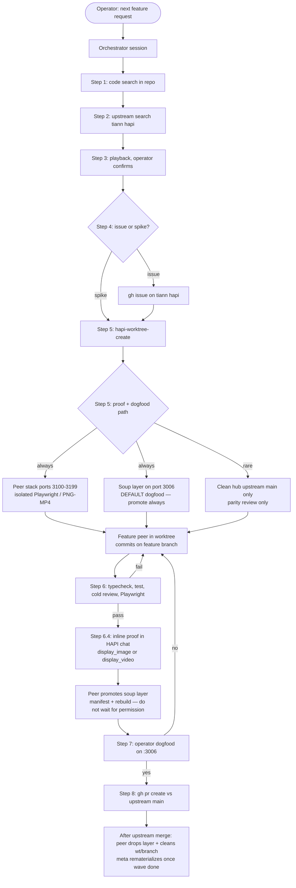
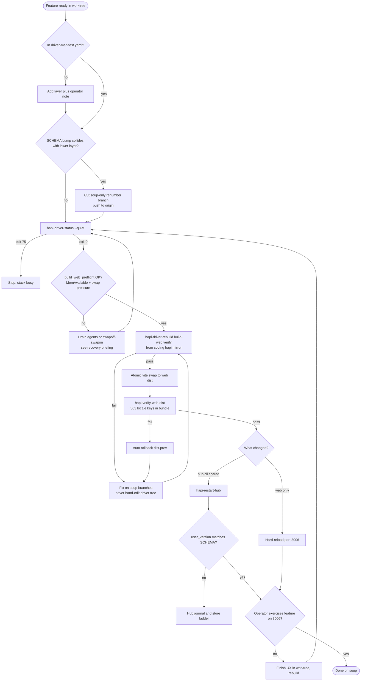

# Feature work lifecycle — single source of truth (heavygee/hapi fork)

**Last updated:** 2026-07-30  
**Audience:** Operator, orchestrators, feature peers — anyone doing local dev on this fork.

## Doc ownership — read this first

**This file is the only place that defines the workflow** (charts, done criteria, agent allow/forbid, soup vs peer stack vs stack swing). Every other doc must **link here** for workflow — not restate it.

| Topic | Sole doc (do not duplicate workflow elsewhere) |
|-------|------------------------------------------------|
| **Workflow** (this file) | Master + soup mermaid, topologies, permissions, ship/done |
| Intake step execution | [`new-feature-intake.md`](./new-feature-intake.md) — §0 handoff + steps 1–8 how-to only |
| Manifest, DB jiu-jitsu, `stack.lock`, atomic swap mechanics | [`driver-soup.md`](./driver-soup.md) (includes oos-linux host matrix) |
| Operator lock install (guards, wrappers, hooks) | [`operator-lock.md`](./operator-lock.md) |
| Move coding subtrees / ACP / hub paths between hosts | [`coding-estate-migration.md`](./coding-estate-migration.md) |
| Git push policy (GitHub-safe vs local-first paths) | [`commit-hooks.md`](./commit-hooks.md) |
| Pre-tidy backup / salvage closure | [`salvage-closure.md`](./salvage-closure.md), [`mirror-main-layout.md`](./mirror-main-layout.md) |
| Peer stack / Playwright evidence | [`peer-stack.md`](./peer-stack.md) |
| Symlink + systemd paths | [`worktree-testing.md`](./worktree-testing.md) |
| `hapi-watch-activate-driver` script | [`watch-activate-driver.md`](./watch-activate-driver.md) |

**Supersedes:** any other doc (including `docs/plans/` briefings) that repeats soup dogfood steps or says `hapi-use-driver` is required when already on `~/coding/hapi/driver`.

---

## Live stack snapshot

**Primary host:** oos-linux guest (`~/coding/hapi` mirror + driver soup). Homelab = tailnet runner only.

| Field | oos-linux (canonical) |
|---|---|
| Dogfood URL | `http://127.0.0.1:3006` (tailnet hostname in hub env — not for upstream issues) |
| `hapi-active` | `~/coding/hapi/driver` → `driver/integration` |
| Hub DB | `/var/lib/hapi/hapi.db` — check `PRAGMA user_version` before stack swings |
| systemd | `hapi-hub-oos.service`, `hapi-runner-oos.service` |
| Manifest | `config/driver-manifest.yaml` on fork `main` (git pull on foundry hosts) |
| Verify | `hapi-verify-web-dist` + `~/.hapi/driver-promotion.json` (typecheck/tests stamp; does not prove dist shipped) |

Refresh this table after major soup promotions. Stale commit hashes belong in git tags / promotion JSON, not here.

**Recent pain (documented):** swap-full host killed vite ~5s into build; recovery = swap reset + full build + verify. See local fork briefing under `docs/plans/` (not pushed to GitHub).

---

## When you say "do the next feature" — master flow



**Policy (2026-07-30):** Soup is where we dogfood. **Never** skip soup promotion because "peer stack was enough" or "upstream tip does not need soup." Peer stack proves isolated UI without yanking `:3006`; soup gets the same tip (heal/union if merge conflicts) so `:3006` stays the tastiest stack. Operator approval is for **click-testing / PR**, not for whether to add the layer.

Intake step numbers (handoff template, playback, gates): [`new-feature-intake.md`](./new-feature-intake.md) — **workflow lives here only**.

---

## Soup dogfood decision tree (production `:3006`)

Follow end-to-end. **Do not declare done at an intermediate box.**



---

## Stack path swing vs in-place restart

HAPI is **one monorepo** (`hub/`, `cli/`, `web/`, `shared/`). Hub and runner must stay on the **same tree**.

| Action | Moves `hapi-active`? | Restarts hub+runner? | Who |
|--------|----------------------|----------------------|-----|
| **`hapi-restart-hub`** | No | Yes (patient) | **Agent** — hub/cli/shared changed, already on driver soup |
| **`hapi-driver-rebuild --build-web`** | No | No | **Agent** — manifest merge + atomic `web/dist` |
| **`hapi-use-driver`** | Yes → driver | Yes (prompt) | **Operator** — stack path swing only |
| **`hapi-use-worktree`** | Yes → target | Yes (prompt) | **Operator** — PR worktree on `:3006`, etc. |

Stack switches **always prompt** (kill remote agent sessions). Non-interactive: `HAPI_STACK_SWITCH_YES=1` + operator TTY. **`hapi-use-driver` is not a substitute for `hapi-restart-hub`** when `readlink -f ~/coding/hapi-active` is already `~/coding/hapi/driver`.

Watch-activate: operator external shell only — [`watch-activate-driver.md`](./watch-activate-driver.md).

---

## Soup dogfood gates (promotion contract)

| Gate | When | Proves |
|------|------|--------|
| Compile pre-flight | rebuild, restart, stack switch | Tree parses; hub store loads |
| Verify stamp | optional `~/.hapi/driver-promotion.json` | typecheck + tests on driver HEAD — **not** that `web/dist` shipped |
| **`hapi-verify-web-dist`** | after every `--build-web` | Merged `web/src` strings in live `web/dist` |
| **`hapi-restart-hub`** | after hub/cli/shared rebuild | Live processes loaded new code |
| Operator proof | feature-specific | Works on `:3006` |

**Agent command sequence (already on driver soup):**

```bash
hapi-driver-status --quiet
hapi-driver-rebuild --build-web --verify
hapi-verify-web-dist
hapi-restart-hub                    # hub/cli/shared only
sqlite3 "$(hapi_systemd_hub_db_path 2>/dev/null || echo ~/.hapi/hapi.db)" 'PRAGMA user_version;'   # if schema bumped
# hard-reload browser
```

**Web-only:** rebuild/build-web + verify-web-dist + hard-reload — no hub restart.

Manifest format, atomic swap mechanics, DB jiu-jitsu: [`driver-soup.md`](./driver-soup.md) only.

---

## Ship / done semantics

| Stage | Meaning |
|-------|---------|
| **Ready for operator** | Peer gates passed; links + inline proof delivered |
| **Operator approved** | Explicit OK to open upstream PR |
| **Shipped upstream** | PR merged on `tiann/hapi` |
| **Post-merge cleanup done** | Session notified; peer dropped soup layer(s); worktree + branch gone (or audit-clean) |
| **Soup rematerialized** | After **all** merged peers in the wave finished cleanup — one `hapi-sync-fork-main` + one `hapi-driver-rebuild --build-web --verify` |
| **Done on soup (web-only)** | Manifest layer + rebuild/build-web + **`hapi-verify-web-dist` OK** + operator hard-reload |
| **Done on soup (hub/cli)** | Rebuild `--verify` + verify-web-dist (if web touched) + **`hapi-restart-hub`** + operator proof on `:3006` |

**Ship After Fix (fork):** when your branch is already in the manifest and you pushed **`web/` only**, `hapi-driver-rebuild --build-web` is part of done — not "wait for operator."

**Not done (common agent lies):**

- `hapi-driver-status` / rebuild exit 0 / verify stamp alone — without **`hapi-verify-web-dist` OK** and **`driverHead` in `web/dist/.hapi-build-meta.json` == `git -C driver rev-parse HEAD`**
- `HAPI_BUILD_MAX_SWAP_USED_PCT=100` (or similar) to force vite under swap thrash — report **blocked**; operator runs swap recovery

---

## Session titles and PR chips

**PR identity + health live on the session chip** (`metadata.externalRefs`), not in the title. ADR D8+ / tiann/hapi#1163.

| Do | Don't |
|----|-------|
| Title = workstream only once chipped: `opt-in awareness` | `PR #1163: opt-in awareness` (redundant with chip) |
| Pre-PR incubating: `Peer #1085: worktree hang` until a PR exists to attach | Prefix titles with `✅` `🔁` `⚠️` `📝` `🔧` (or `?`) for CI/health |
| Attach with `hapi link-pr <url\|owner/repo#N>`, MCP `link_pr`, or the session **Link PR** dialog (requires Settings → GitHub PR awareness) | Rely on title scraping as the durable bind |
| Read status from the chip / Meta action queue / `hapi-pr-status <N>` | Re-encode green/red into the title with `change_title` **or** `PATCH /sessions/:id` `{name}` |
| Let Meta strip leftover leading status emoji **and** `PR #N:` from chipped titles | Run removed stub `hapi-pr-session-emoji.sh` then stop — it exits 2 and prints `hapi-meta-daily.sh [--pr N]`; run that; do **not** hand-roll title emoji |

Daily classify + chip cache + pings: `./scripts/tooling/hapi-meta-daily.sh` (see [`docs/operator/AGENTS.md`](../operator/AGENTS.md) § Meta PR watcher). After rebase/CI flips on a babysat PR: `./scripts/tooling/hapi-meta-daily.sh --pr <N>`. On this estate, systemd timers run full Meta **hourly at :00 Europe/London** (pings + wave unlock; BST/GMT) plus quiet refresh every 45m **24/7**; chip UI mutes to `?` when `statusCheckedAt` is older than 2h. Session-list **filters** by chip / attention state are fork follow-ups (not title search).

---

## After upstream merge (fleet cleanup — meta sweep MUST advise this)

When a PR merges on `tiann/hapi`, do **not** stop at "congrats, archive yourself." The estate still carries a soup layer and a worktree until someone removes them — and self-archive mid-turn leaves untidy tool UI.

### Sequence (accurate)

```text
1. Meta daily notifies the responsible HAPI session (chip status → merged; ping)
2. That peer drops their layer(s) from ~/.config/hapi/driver-manifest.yaml
3. That peer cleans worktree + local/remote branch
4. When ALL merged peers in the wave report cleanup done → ONE rematerialize
```

| Step | Who | What |
|------|-----|------|
| **1. Notify** | Meta / orchestrator on sweep | Reopen named PR session if archived; post MERGED brief (chip already shows `merged` / 🔧). Keep workstream title — **do not** rename to `🔧PR #N MERGED: …`. Classifier action string encodes the cleanup checklist. |
| **2. Drop soup layer(s)** | **Feature peer** (owner of the layer) | Edit `~/.config/hapi/driver-manifest.yaml`: remove the `- branch:` entry (leave a `# DROPPED YYYY-MM-DD: … MERGED as #N` comment). Do **not** hand-edit `~/coding/hapi/driver`. Do **not** each fire a full rebuild during a multi-PR merge wave. |
| **3. Clean worktree + branch** | **Feature peer** | From mirror: `git worktree remove ~/coding/hapi/worktrees/<name>` (or `--force` if dirty junk only); delete local branch; `git push origin --delete <branch>` when the remote tip is fully in `upstream/main`. Confirm with `hapi-branch-audit --quiet` (expect no `MERGED` row for that branch). |
| **4. Rematerialize soup** | Meta tooling bot (unlocked by Meta daily) **or** operator — **once per wave** | Gate A: owned peers only (layer gone + worktree gone). Orphans never block. Meta daily collects ~30m then unlock-pings Meta tooling on the hourly Europe/London ping windows. Manual mid-window rebuilds are fine — unlock defers while `hapi-driver-status --quiet` is busy (75). Then: `hapi-sync-fork-main` + `git push origin main` → `hapi-driver-status --quiet` → `hapi-driver-rebuild --build-web --verify` → `hapi-verify-web-dist` → `hapi-restart-hub` if hub/cli changed. Meta CLI never rebuilds itself. |
| **5. Archive / idle the peer session** | Prefer **meta** after peer acks idle; peer only if turn is already done | See **Stand down without self-immolation** below. |

### Stand down without self-immolation

**Do not `POST /api/sessions/<your-own-id>/archive` (or equivalent) from inside your own active turn.**

Self-archive mid-turn yanks the runner while a tool call is still on the chat surface. The UI often leaves that block with a running duration spinner (e.g. `47.9s`) even after the curl returned — same class of failure as restarting the hub under live agents.

Correct stand-down:

1. Finish cleanup tools (manifest drop, worktree/branch delete) and reply to meta that steps 1–3 are done.
2. **End the turn cleanly** — no further tool calls that mutate this session's lifecycle.
3. Let the session go idle / inactive naturally (`thinking` / WORKING clear).
4. **Meta** (or the operator) archives from **outside** when the session is idle. Peer may archive themselves only in a follow-up turn that does **nothing else** — no Shell/tool chrome after the archive call.

Hard rule for meta briefs: say **"ack cleanup, then idle — do not self-archive mid-turn; meta will archive when idle"** — not bare "stand down / archive this session."

### Why not "each peer rebuilds after drop"?

Manifest edits during a merge wave must settle first. Parallel peer rebuilds thrash the flock, race mid-edit manifests, and rebuild N times for one tip. **Peers clean; one agent rematerializes.** Solo merge (one PR): same agent may do drop + rematerialize in one turn — "all" is trivially one.

### Meta sweep checklist (when YOU see chip `merged` / 🔧 / `merged: true`)

Advise the peer session with all five beats — not just "stand down":

1. Congrats + link to merged PR / tip SHA if known (chip already carries merged status — leave the title alone)
2. **Drop your soup layer(s)** now (paths/branch names if known from manifest)
3. **Remove worktree + delete branch** (`hapi-branch-audit` until clean)
4. Reply here when done — **do not** rematerialize yourself if other merges in this wave are still cleaning; meta will rebuild once the wave is clear
5. **Idle cleanly** — do **not** self-archive mid-turn (orphans tool-call UI). Meta archives after ack when the session is idle.

If the peer has **no** soup layer (never promoted): skip step 2; still do worktree/branch cleanup + idle rule.

Hard rules unchanged: never merge on `tiann/hapi`; never `cp`/`rsync` into `driver/web/dist`; never stack-switch from agent shell; never self-archive mid-turn.

Manifest / rebuild mechanics: [`driver-soup.md`](./driver-soup.md) § When upstream moves.

---

## Worktrees, branches, commits — who touches what

| Artifact | Where | Branch base | Commits go to | Never |
|----------|-------|-------------|---------------|-------|
| **Upstream PR work** | `~/coding/hapi/worktrees/<name>/` | `upstream/main` (+ optional `--after` merge train) | `feat/…` / `fix/…` on origin | PR from `driver/integration` |
| **Fork docs / tooling** | `~/coding/hapi/` mirror | `main` (fork) | `heavygee/hapi` main | In upstream PR diff |
| **Soup integration** | `~/coding/hapi/driver/` | `driver/integration` (rebuilt only) | **No hand commits** — manifest merge only | Agent `git commit` in driver |
| **Manifest** | `~/.config/hapi/driver-manifest.yaml` | n/a | Operator notes / fork docs | Committed secrets |

**Create worktree (canonical):**

```bash
hapi-worktree-create my-feature --branch feat/my-feature
# → ~/coding/hapi/worktrees/my-feature
```

**One feature → one worktree → one peer agent.** Handoff block required: [`new-feature-intake.md` §0](../tooling/new-feature-intake.md#0--feature-peer-agent--mandatory-handoff).

---

## Proof path + soup dogfood (not mutually exclusive)

Peer stack and soup are **both** required for normal feature work. They solve different problems.

### 1. Peer stack — isolated Playwright / §6.4 evidence

- **Ports:** hub `3100–3199`, separate `HAPI_HOME` under `~/.hapi-peer/`
- **Safe for agents:** `hapi-peer-stack up|down|status|doctor` — **never** touches systemd or `:3006`
- **Proof:** Playwright on real `/sessions/:id` UI; PNG and/or MP4 under `localdocs/playwright-runs/` (gitignored)
- **Inline in HAPI chat:** `display_image` / `display_video` MCP, or `bun scripts/tooling/hapi-display-image.mjs <session-prefix> <absolute-path> [title]`
- **Not a soup substitute:** peer proof does **not** mean skip manifest promotion

### 2. Soup — daily driver on `:3006` (**always promote**)

- **When:** tip is ready for operator dogfood (after or in parallel with peer-stack proof). **Default. Not optional.**
- **Agent-owned:** edit `~/.config/hapi/driver-manifest.yaml` (and commit `config/driver-manifest.yaml` on mirror), then `hapi-driver-rebuild --build-web [--verify]`, `hapi-verify-web-dist`, **`hapi-restart-hub`** if hub/cli/shared changed
- **Conflicts:** trial-merge first; write `scripts/tooling/soup-heals/*.patch` or a `driver/<feature>` union tip — **do not** leave the feature out of soup
- **Agent-forbidden:** `hapi-use-driver`, `hapi-use-worktree`, `hapi-driver-rebuild --activate`, raw `sudo systemctl restart hapi-hub`
- **Web-only layer:** atomic `web/dist` swap + hard-reload — no hub restart
- **Hub/cli layer:** rebuild `--verify` + `hapi-restart-hub` + confirm `user_version`
- **Done on soup:** operator can use feature on `:3006` + verify-web-dist exit 0 — **not** verify stamp alone

### 3. Clean — upstream/main only (rare)

- Separate Proxmox/LAN hub, new port, isolated DB
- For upstream-parity review without fork soup layers — **does not replace** putting the feature in soup for estate dogfood

---

## Proof tiers (images and video)

Peers **must** assess tier before capture ([`peer-stack.md` § Evidence modality](../tooling/peer-stack.md#evidence-modality--agent-decides-png-vs-mp4)).

- **§6.4b PNG** — static existence (label, layout, copy, icon). Always for visible UI change.
- **§6.4c MP4/GIF** — interaction story (toggle, send, drawer, async feedback). 3–10s, annotated screencast preferred.
- **§6.4d Inline** — post into **HAPI web session chat** (not Cursor composer paths). Session needs `metadata.hapiMcpUrl` (ACP + MCP bridge, e.g. Cursor #956).
- **§8 PR** — attach the same assets to the GitHub PR **without** committing binaries. Preferred: estate **`pr-attach-proof ./shot.png --pr owner/repo#N`** (or `hapi-dogfood-shot --from … --pr …`). Exact `user-attachments/assets/…` still needs manual PR UI drag-drop (no public API; [cli/cli#13256](https://github.com/cli/cli/issues/13256)). See [`dogfood-shot.md` § PR attach](./dogfood-shot.md#pr-attach-recommended-path) and `github-operations` skill.

**Tool names in HAPI agent sessions**

- **Oneshoot proof helper (preferred for SessionChat / re-displaying e2e PNGs):** `hapi-dogfood-shot` — reliable auth + screenshot *or* `--from existing.png`, then `display_image`, plus `--pr` for GitHub attach (or `--pr-checklist` for manual UI). **Not a test runner.** See [`dogfood-shot.md`](./dogfood-shot.md). Do **not** hand-roll Playwright auth against `:3006` just to get a chat PNG.
- MCP: `display_image`, `display_video` (when bridge present)
- CLI fallback: `hapi-display-image.mjs` (auto-routes video MIME to display_video when available)

**CLI bring-up (agent-agnostic):** on success, `hapi-worktree-create`, `hapi-peer-stack up`, and `hapi-driver-rebuild` print a short §6.4 checklist to stderr (`scripts/tooling/lib/hapi-feature-peer-reminders.sh`). Mute with `HAPI_SKIP_FEATURE_PEER_REMINDERS=1`.

---

## Commits and PRs — order of operations

1. **Implement** in worktree; conventional commits on feature branch
2. **Push** feature branch to `heavygee/hapi` (or fork remote)
3. **Peer gates** (§6) — all green before operator browser test (`hapi-pr-status <N>` once a PR exists)
4. **Operator dogfood** (§7) — explicit approval
5. **Upstream PR** (§8) — `gh pr create` → `tiann/hapi` `main`, `Fixes #NNN`, cold review, post-push monitor. Then **attach** to this HAPI session (`hapi link-pr …` / MCP `link_pr` / Link PR dialog). Title = workstream only (no `PR #N:` — chip shows identity + health after Meta classify).
6. **Soup promotion** (optional / parallel) — manifest layer + rebuild tree above — **after** branch is merge-ready, not instead of peer proof

**Fork-only files never in upstream PR:** `docs/operator/`, `docs/plans/`, `CLAUDE.md`, `.cursor/`, operator tooling under `scripts/tooling/` unless upstreamable separately.

---

## Soup build: system vs web

| Layer touched | Rebuild command | Hub restart | Browser |
|---------------|-----------------|-------------|---------|
| `web/` only | `hapi-driver-build-web` or `rebuild --build-web` | No | Hard-reload |
| `hub/`, `cli/`, `shared/` | `hapi-driver-rebuild --build-web --verify` | **`hapi-restart-hub`** | Hard-reload if web also built |
| Manifest order / new layer | `hapi-driver-rebuild --build-web --verify` | If hub/cli changed | Hard-reload |

**Web/dist guarantee (2026-06-22):**

- Atomic swap via `dist.next` → `dist` (live never empty mid-build)
- Post-swap: `verify-soup-web-dist.mjs` — fail rolls back to `dist.prev`
- Audit anytime: `hapi-verify-web-dist`
- Memory preflight (`build_web_preflight.sh`, wired into `build_web_atomic`):
  - **Refuses** when `MemAvailable` < **2 GiB** (`HAPI_BUILD_MIN_AVAIL_MEM_KIB`, default 2097152)
  - **Refuses** when swap > **85%** *and* `MemAvailable` < **4 GiB** — active memory pressure (`HAPI_BUILD_SWAP_PRESSURE_AVAIL_KIB`, default 4194304)
  - **Warns and proceeds** when swap >85% but `MemAvailable` ≥ 4 GiB (sticky swap from an earlier spike; RAM headroom is fine)
  - Agent shells cannot lower thresholds via env overrides — report **blocked**; operator runs recovery
  - Optional: `sync; echo 1 > /proc/sys/vm/drop_caches` before the check (skipped when `HAPI_BUILD_PREFLIGHT_SKIP_DROP_CACHES=1`)

**Do not** run raw `bun run build` in `driver/web/` for production dogfood — bypasses atomic swap and preflight (recovery build 2026-06-22 was emergency only).

---

## Agent permission matrix (short)

**Allowed**

- Edit product code in `~/coding/hapi/worktrees/<name>/`
- **`~/.config/hapi/driver-manifest.yaml`** — add/update your feature layer when the tip is ready for `:3006` dogfood (peer-stack proof does not replace this)
- `hapi-peer-stack up|down|status|doctor`
- `hapi-driver-status --quiet` → **`hapi-driver-rebuild --build-web [--verify]`** (manifest merge **and** atomic `web/dist` — the supported soup promotion path)
- `hapi-driver-build-web`, `hapi-verify-web-dist`
- **`hapi-restart-hub`** when hub/cli changed and already on driver soup
- `hapi-driver-rollback-web` (web emergency)

**Forbidden**

- Hand-edit `~/coding/hapi/driver/` (no `git merge` / cherry-pick / commit in driver — manifest + rebuild only)
- **`hapi-driver-rebuild` without `--build-web`** (manifest-only merge — stale `web/dist`; agent guard refuses)
- `hapi-use-worktree`, `hapi-use-driver`, `hapi-driver-rebuild --activate`
- Raw `sudo systemctl restart/stop` on hub/runner units (use `hapi-restart-hub` / `hapi-use-worktree` — they resolve `hapi-hub-oos` vs `hapi-hub`)
- `nohup bun run src/index.ts` from worktree on `:3006` / shared hub DB
- Declare done at verify stamp without `hapi-verify-web-dist` + operator `:3006` proof
- Treat `hapi-driver-status` or manifest merge complete as web shipped
- `HAPI_BUILD_MAX_SWAP_USED_PCT` / `HAPI_BUILD_MIN_AVAIL_MEM_KIB` overrides on driver web builds (report blocked)

---

## What you should expect on the next feature request

1. **Orchestrator** runs search + playback; you confirm scope.
2. **Peer** gets explicit handoff (completed vs owned steps).
3. **Worktree** appears under `~/coding/hapi/worktrees/<name>`.
4. **Default proof** is peer stack — you see PNG/MP4 **inline in HAPI chat** without yanking `:3006`.
5. **Always soup-promote** the same tip (heal/union if needed) → `hapi-driver-rebuild --build-web --verify` → verify-web-dist → restart if needed → operator hard-reloads and click-tests on `:3006`.
6. **After operator dogfood approval:** upstream PR; soup layer stays until merged upstream or dropped from manifest.

---

## Soup promotion (peer-owned — default, not optional)

**Default feature flow:** peer stack proof on `:3100+` **and** soup layer on `:3006`. Peer promotes without waiting for "please put this in soup." Operator dogfood is the click-test on the promoted stack.

**Peer sequence (from mirror `~/coding/hapi`):**

```bash
# 1. Edit ~/.config/hapi/driver-manifest.yaml — add branch: feat/your-feature
#    (or driver/<name> union tip when thin upstream tip conflicts with soup)
#    Commit config/driver-manifest.yaml on mirror the same turn (mess-maker rule).
# 2. One rebuild owner at a time (hapi-driver-status --quiet; exit 75 = wait)
hapi-driver-rebuild --build-web --verify
hapi-verify-web-dist
# 3. Hub/cli/shared touched? (not web-only)
hapi-restart-hub
# 4. Operator hard-reloads :3006 and exercises the feature
```

**What "do it RIGHT" means (guards, not disempowerment):**

| Wrong | Right |
|-------|-------|
| Skip soup because peer stack passed | Promote + rebuild so `:3006` has the tip |
| `hapi-driver-rebuild` (no `--build-web`) | `hapi-driver-rebuild --build-web --verify` |
| `git merge` inside `~/coding/hapi/driver` | Edit manifest; let rebuild merge layers |
| `cp worktrees/*/web/dist` into driver | Atomic swap via rebuild/build-web |
| `hapi-use-driver` / `hapi-use-worktree` | Already on driver soup — use `hapi-restart-hub` |
| Declare done at verify stamp alone | `hapi-verify-web-dist` exit 0 + operator `:3006` proof |
| Leave layer out on merge conflict | `soup-heals/*.patch` or `driver/<feature>` union tip |

**Operator role:** click-test on `:3006` and approve upstream PR — **not** hand-edit the manifest for every feature, and **not** a gate that withholds soup promotion.

**Friction mode — kill criteria**

- Peer stops at "tests pass" with no inline PNG/MP4 → reject handoff (§6.4d).
- Peer stops at verify stamp with verify-web-dist failing → dist still stale (2026-06-22 class bug).
- Peer runs `hapi-use-driver` without operator TTY → session massacre; use `hapi-restart-hub` instead when already on driver.
- Vite fails at ~5s → `free -h`: if swap high **and** `MemAvailable` low, run recovery; sticky swap alone (high swap, ≥4 GiB available) should not block rebuild after 2026-06-19 preflight fix.

---

## Outside the master mermaid (still local dev)

The intake mermaid is the **"operator requests next feature"** path. These cases are documented in linked files, not duplicated in the chart:

- **Mirror-only work** — fork docs, `scripts/tooling/`, `.cursor/` on `~/coding/hapi` `main` (no worktree, no soup rebuild)
- **Operator stack swing to a PR worktree on `:3006`** — `hapi-use-worktree` (no manifest layer); kills sessions; [worktree-testing.md](./worktree-testing.md)
- **Fork sync / branch hygiene** — `hapi-sync-fork-main`, `hapi-branch-audit`; [repo-layout-and-dev-flow.md](../operator/repo-layout-and-dev-flow.md)
- **Garden** — separate product repo proxying `:3006`; [driver-soup.md](./driver-soup.md)
- **Windows estate agents** — Teemo scope lock; [windows-estate-agents.md](../operator/windows-estate-agents.md)
- **PR review loop** — cold review, post-push monitor; [pr-review-loop.md](./pr-review-loop.md)

Historical **`docs/plans/`** peer briefings may contradict lifecycle until refreshed — see [DOC-SUPERSESSION.md](../plans/DOC-SUPERSESSION.md).

---

## Related documents (reference only — no workflow duplication)

- [`new-feature-intake.md`](./new-feature-intake.md) — §0 handoff + steps 1–8 execution
- [`driver-soup.md`](./driver-soup.md) — manifest, DB jiu-jitsu, locks, atomic swap
- [`peer-stack.md`](./peer-stack.md) — isolated stack commands
- [`DOC-SUPERSESSION.md`](../plans/DOC-SUPERSESSION.md) — stale plan briefings
- [`AGENTS.md`](../operator/AGENTS.md) — fork identity, upstream PR rules (not workflow)
